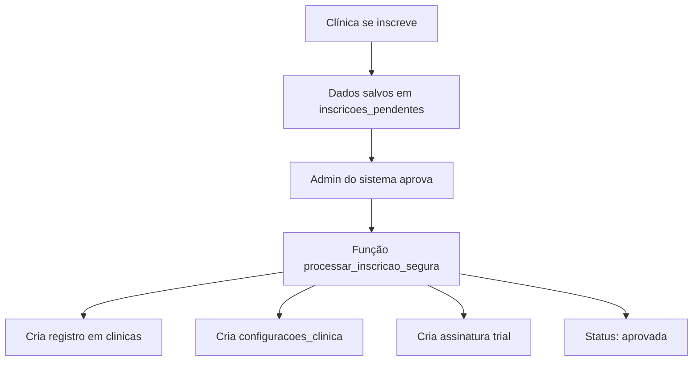
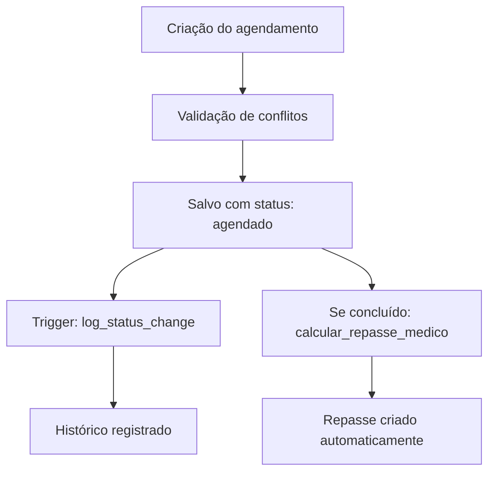
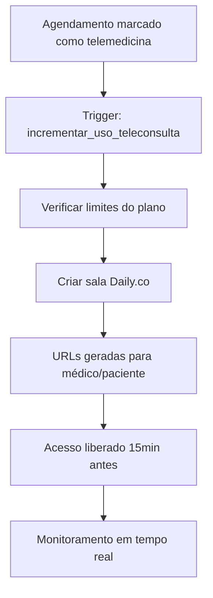

# Análise Completa do Sistema Multi-Empresas - Banco de Dados

## 🏗️ ARQUITETURA GERAL

### Conceito Multi-Tenant
O sistema é projetado como **multi-tenant**, onde cada clínica opera de forma completamente isolada através de:
- **`clinica_id`**: Campo presente em TODAS as tabelas principais para garantir isolamento
- **Row Level Security (RLS)**: Políticas no banco que filtram automaticamente os dados por clínica
- **Sessões isoladas**: Cada login estabelece contexto específico da clínica

---

## 📊 ESTRUTURA DAS TABELAS PRINCIPAIS

### 1. **TABELAS ADMINISTRATIVAS**

#### `admin_users` - Administradores do Sistema
- **Função**: Usuários que gerenciam o sistema como um todo
- **Campos críticos**: `email`, `password_hash`, `salt`, `failed_attempts`, `locked_until`
- **Segurança**: Hash com salt, bloqueio após tentativas, RLS restritivo

#### `admin_sessions` - Sessões Administrativas  
- **Função**: Controla sessões ativas dos administradores
- **Campos**: `session_token`, `expires_at`, `ip_address`, `user_agent`
- **Isolamento**: Cada admin só vê suas próprias sessões

#### `admin_logs` - Logs Administrativos
- **Função**: Registra todas as ações administrativas
- **Campos**: `acao`, `detalhes` (JSONB), `admin_session_id`, `ip_address`
- **Auditoria**: Log completo de ações para compliance

---

### 2. **TABELAS DE CLÍNICAS**

#### `clinicas` - Registro Principal das Clínicas
```sql
Campos principais:
- id (UUID) - Identificador único
- nome - Nome da clínica
- email - Email principal (usado para login)
- telefone, endereco - Dados de contato
- subdominio - Subdomínio personalizado (único)
- foto_perfil_url - Logo/foto da clínica
```

#### `configuracoes_clinica` - Configurações Específicas
```sql
Configurações importantes:
- email_login_clinica - Email de acesso
- senha_hash_secure - Senha hasheada (bcrypt)
- salt - Salt para criptografia
- codigo_acesso_admin/clinica/funcionario - Códigos únicos
- verificacao_automatica - Auto-confirmação agendamentos
- telemedicina_ativa - Teleconsultas habilitadas
- mfa_enabled - Autenticação 2FA
- account_locked - Conta bloqueada
- failed_login_attempts - Tentativas de login
```

#### `assinaturas` - Controle de Pagamentos
```sql
Controle financeiro:
- clinica_id - Referência à clínica
- tipo_plano - basico, avancado, premium, trial
- periodo_meses - 1, 6, 12 meses
- status - ativa, trial, suspensa, cancelada
- valor, data_inicio, proximo_pagamento
- stripe_customer_id, stripe_subscription_id
```

---

### 3. **TABELAS DE USUÁRIOS**

#### `medicos` - Cadastro de Médicos
```sql
Isolamento: clinica_id
Campos especiais:
- crm, coren - Registros profissionais
- especialidade - Área médica
- percentual_repasse - % de repasse por consulta
- senha_acesso - Login para portal médico
- categoria_trabalho[] - Array de categorias
- ativo - Status no sistema
```

#### `funcionarios` - Funcionários da Clínica
```sql
Isolamento: clinica_id
Controle:
- funcao - Cargo/função
- cpf, rg - Documentos
- email, telefone - Contato
- ativo - Status
```

#### `pacientes` - Cadastro de Pacientes
```sql
Isolamento: clinica_id
Dados completos:
- cpf - Usado para login no portal
- senha_acesso - Acesso portal paciente
- convenio_id, numero_convenio - Plano de saúde
- dados pessoais completos (nome, telefone, endereço)
- peso, altura, idade - Dados médicos
```

---

### 4. **TABELAS DE AGENDAMENTOS**

#### `agendamentos` - Sistema de Agendas
```sql
Núcleo do sistema:
- clinica_id, paciente_id, medico_id
- data_agendamento, horario, horario_fim
- tipo_exame - Tipo do procedimento
- status - agendado, confirmado, em_andamento, concluido, cancelado, faltou
- valor_exame, valor_pago, status_pagamento
- eh_telemedicina - Flag para teleconsultas
- observacoes, arquivo_comprovante_url
```

#### `agendamentos_historico` - Auditoria de Mudanças
```sql
Rastreamento:
- agendamento_id - Referência
- status_anterior, status_novo
- automatico - Se foi mudança automática
- detalhes (JSONB) - Dados da mudança
- clinica_id - Isolamento
```

#### `lista_espera_agendamentos` - Fila de Espera
```sql
Gestão de vagas:
- clinica_id, paciente_id, medico_id
- tipo_exame, data_preferencia, periodo_preferencia
- status - aguardando, chamado, agendado
- prioridade - Nível de prioridade
```

#### `chamadas_lista_espera` - Controle de Chamadas
```sql
Processo de contato:
- lista_espera_id - Referência à espera
- data_vaga_disponivel, horario_vaga_disponivel
- metodo_contato - telefone, email, whatsapp
- contato_realizado, resposta_paciente
- prazo_resposta - Tempo limite para resposta
```

---

### 5. **TABELAS DE EXAMES**

#### `exames` - Central de Exames
```sql
Gestão de laudos:
- clinica_id, paciente_id, medico_id
- tipo, data_exame, status
- arquivo_url, arquivo_nome - Arquivo principal
- imagens_urls[], imagens_nomes[] - Múltiplas imagens
- laudo_url, laudo_nome - Laudo médico
- comentarios - Observações
```

#### `categorias_exames` - Tipos de Exames
```sql
Organização:
- clinica_id - Isolamento
- nome, descricao
- categoria_pai_id - Hierarquia de categorias
- valor - Preço padrão
- ativo - Status
```

#### `exames_valores` - Preços dos Exames
```sql
Tabela de preços:
- clinica_id, tipo_exame
- valor, descricao
- ativo - Se está disponível
```

---

### 6. **TABELAS MÉDICAS**

#### `receitas_medicas` - Prescrições
```sql
Receituário:
- clinica_id, medico_id, paciente_id
- medicamentos - Prescrição completa
- tipo_receita - basica, controlada, especial
- data_emissao, observacoes
```

#### `atestados_medicos` - Atestados
```sql
Atestados médicos:
- clinica_id, medico_id, paciente_id
- tipo_atestado - medico, trabalho, escolar
- dias_afastamento, data_inicio/fim_afastamento
- cid - Classificação da doença
- observacoes - Detalhes médicos
```

#### `anotacoes_medicas` - Prontuário
```sql
Histórico médico:
- clinica_id, medico_id, paciente_id
- agendamento_id - Consulta relacionada
- tipo_anotacao - consulta, retorno, emergencia
- titulo, conteudo - Anotação médica
- data_anotacao - Timestamp
```

---

### 7. **TABELAS DE TELEMEDICINA**

#### `teleconsultas` - Consultas Online
```sql
Sistema de videochamadas:
- clinica_id, agendamento_id, medico_id, paciente_id
- sala_id, daily_room_name - Identificadores da sala
- url_medico, url_paciente - Links específicos
- status - agendada, em_andamento, finalizada
- data_inicio, data_fim, duracao_segundos
- medico_entrou_em, paciente_entrou_em
- gravacao_ativada, url_gravacao
- daily_room_config (JSONB) - Configurações Daily.co
```

#### `teleconsulta_participantes` - Controle de Acesso
```sql
Monitoramento em tempo real:
- teleconsulta_id, usuario_id, tipo_participante
- entrou_em, saiu_em, esta_online
- camera_ativada, microfone_ativado, tela_compartilhada
- qualidade_audio, qualidade_video, latencia_ms
```

#### `teleconsultas_uso_mensal` - Controle de Limites
```sql
Faturamento:
- clinica_id, mes_referencia
- total_utilizadas - Teleconsultas usadas
- pacotes_adicionais_comprados - Pacotes extras
```

---

### 8. **TABELAS FINANCEIRAS**

#### `repasses_medicos` - Repasses aos Médicos
```sql
Cálculo automático:
- clinica_id, medico_id, agendamento_id
- valor_consulta, percentual_repasse, valor_repasse
- mes_referencia, status (pendente, pago)
- data_pagamento, observacoes
```

#### `faturas_medicos_mensais` - Faturamento Extra
```sql
Cobrança por médicos extras:
- clinica_id, mes_referencia
- total_medicos, medicos_extras
- valor_por_medico, valor_total
- status, data_vencimento, data_pagamento
```

#### `planos_assinatura` - Planos Disponíveis
```sql
Configuração de planos:
- tipo_plano - basico, avancado, premium, trial
- periodo_meses - 1, 6, 12
- valor_base, percentual_desconto, valor_final
- limite_funcionarios, limite_medicos
- limite_teleconsultas_gratuitas
- funcionalidades_bloqueadas[]
```

---

### 9. **TABELAS DE CONTROLE**

#### `logs_acesso` - Auditoria Geral
```sql
Log de ações:
- acao - Tipo de ação
- tabela_afetada - Tabela modificada
- usuario_id, registro_id
- detalhes (JSONB) - Dados da ação
- ip_address, user_agent
```

#### `email_lembretes` - Sistema de Email
```sql
Notificações automáticas:
- clinica_id, agendamento_id
- email_paciente, status_envio
- data_envio, tentativas, erro_envio
```

#### `notificacoes_pagamento` - Cobranças
```sql
Avisos de vencimento:
- clinica_id, data_vencimento
- tipo_notificacao - aviso, vencimento, corte
- status_envio, tentativas, ultimo_erro
```

---

### 10. **TABELAS DE INSCRIÇÕES**

#### `inscricoes_pendentes` - Novas Clínicas
```sql
Processo de cadastro:
- nome_clinica, nome_responsavel
- email_responsavel, cpf_responsavel, telefone
- subdominio_solicitado - Deve ser único
- dados_completos (JSONB) - Informações extras
- status - pendente, aprovada, rejeitada
- processada_em, processada_por
- senha_escolhida - Senha definida pela clínica
```

---

## 🔐 SISTEMA DE SEGURANÇA

### Row Level Security (RLS)
Cada tabela principal tem políticas que garantem:
```sql
-- Exemplo de política padrão
CREATE POLICY "Isolamento por clinica" 
ON nome_tabela 
FOR ALL 
USING (clinica_id IN (
  SELECT clinicas.id 
  FROM clinicas 
  WHERE clinicas.id = nome_tabela.clinica_id
));
```

### Controle de Acesso por Tipo de Usuário

#### **Administradores do Sistema**
- Acesso total ao sistema
- Podem gerenciar todas as clínicas
- Processam inscrições de novas clínicas
- Visualizam logs e relatórios globais

#### **Administradores de Clínica**
- Acesso total aos dados da sua clínica
- Gerenciam funcionários, médicos, pacientes
- Configurações e relatórios da clínica
- Acesso ao dashboard financeiro

#### **Funcionários**
- Acesso baseado na função
- Podem gerenciar agendamentos e pacientes
- Acesso limitado a relatórios
- Não acessam configurações críticas

#### **Médicos**
- Acesso aos seus agendamentos
- Podem criar receitas e atestados
- Visualizam pacientes da clínica
- Portal específico para teleconsultas

#### **Pacientes**
- Acesso apenas aos seus próprios dados
- Portal com exames e agendamentos
- Login com CPF + senha
- Acesso a teleconsultas agendadas

---

## 🔄 FLUXOS PRINCIPAIS

### 1. **Fluxo de Cadastro de Nova Clínica**


### 2. **Fluxo de Agendamento**


### 3. **Fluxo de Teleconsulta**


---

## 🚨 PROBLEMAS IDENTIFICADOS

### 1. **Sistema de Inscrições**
- ❌ Clínicas aprovadas podem não aparecer corretamente
- ❌ Função `processar_inscricao_segura` pode ter bugs
- ❌ Falta validação de subdomínios únicos

### 2. **Segurança de Senhas**
- ❌ Algumas clínicas ainda usam senhas padrão
- ❌ Sistema híbrido de hash (senha_hash vs senha_hash_secure)
- ❌ Falta migração completa para bcrypt

### 3. **Sistema de Emails**
- ⚠️ Configuração presente mas precisa testes
- ⚠️ Templates podem não estar completos
- ⚠️ Falta monitoramento de entregas

### 4. **Controle de Limites**
- ⚠️ Verificação de limites por plano não está completa
- ⚠️ Faturamento adicional pode ter falhas

---

## 📈 MÉTRICAS E RELATÓRIOS

O sistema gera relatórios em:
- **Agendamentos**: Por período, médico, status
- **Financeiro**: Receitas, repasses, inadimplência  
- **Operacional**: Produtividade, tempo médio
- **Teleconsultas**: Uso, qualidade, limites

---

## 🔧 MANUTENÇÃO E LIMPEZA

### Processos Automáticos
- `limpar_codigos_expirados()`: Remove códigos de recuperação antigos
- `limpar_emails_antigos()`: Cancela emails com erro após 24h
- Triggers automáticos para histórico e repasses

### Monitoramento
- Logs detalhados em `logs_acesso`
- Auditoria em `agendamentos_historico`
- Sessões ativas em tabelas de sessão

---

## 🎯 PRÓXIMOS PASSOS RECOMENDADOS

1. **Corrigir função de processamento de clínicas**
2. **Migrar completamente para bcrypt**
3. **Implementar validação rigorosa de subdomínios**
4. **Testar sistema de emails em produção**
5. **Implementar monitoramento de limites em tempo real**
6. **Criar dashboard de saúde do sistema**