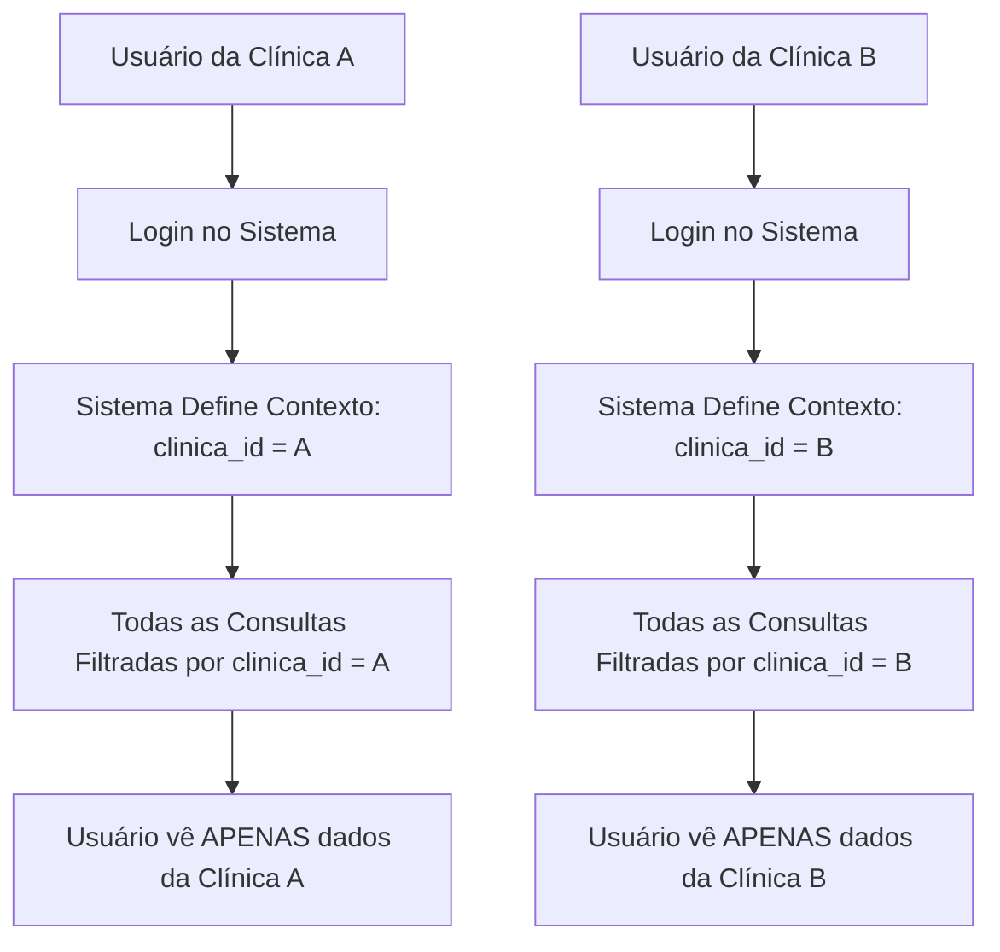

# Documentação do Banco de Dados - Sistema Multiclínicas

## Visão Geral

O sistema Unovai Exame Cloud utiliza um banco de dados PostgreSQL hospedado no Supabase, projetado para suportar **múltiplas clínicas** de forma completamente isolada. Cada clínica opera como um "tenant" independente, garantindo que os dados de uma clínica nunca sejam visíveis ou acessíveis por outra.

## 🏗️ Arquitetura Multi-Tenant

### Conceito de Isolamento
- **Tenant**: Cada clínica é um "tenant" (inquilino) do sistema
- **Isolamento por `clinica_id`**: Todas as tabelas principais contêm um campo `clinica_id` que garante a separação dos dados
- **Row Level Security (RLS)**: Políticas de segurança no banco garantem que cada consulta só retorne dados da clínica logada

### Como Funciona o Isolamento

```sql
-- Exemplo: Quando uma clínica busca pacientes
SELECT * FROM pacientes WHERE clinica_id = 'uuid-da-clinica-logada';

-- O RLS automaticamente adiciona essa condição em TODAS as consultas
```

## 📊 Estrutura das Tabelas Principais

### 1. **clinicas** - Registro das Clínicas
```sql
- id (UUID) - Identificador único da clínica
- nome (TEXT) - Nome da clínica
- email (TEXT) - Email principal
- telefone (TEXT) - Telefone de contato
- endereco (TEXT) - Endereço completo
- subdominio (TEXT) - Subdomínio personalizado
- foto_perfil_url (TEXT) - URL da foto/logo
- created_at (TIMESTAMP) - Data de criação
- updated_at (TIMESTAMP) - Última atualização
```

### 2. **pacientes** - Cadastro de Pacientes
```sql
- id (UUID) - Identificador único
- clinica_id (UUID) - CHAVE DE ISOLAMENTO
- nome (TEXT) - Nome completo
- cpf (TEXT) - CPF do paciente
- email (TEXT) - Email do paciente
- telefone (TEXT) - Telefone principal
- data_nascimento (DATE) - Data de nascimento
- endereco_completo (TEXT) - Endereço completo
- convenio_id (UUID) - Referência ao convênio
- senha_acesso (TEXT) - Senha para portal do paciente
```

### 3. **medicos** - Cadastro de Médicos
```sql
- id (UUID) - Identificador único
- clinica_id (UUID) - CHAVE DE ISOLAMENTO
- nome_completo (TEXT) - Nome do médico
- crm (TEXT) - Número do CRM
- coren (TEXT) - Número do COREN (enfermeiros)
- cpf (TEXT) - CPF do médico
- especialidade (TEXT) - Especialidade médica
- email (TEXT) - Email do médico
- telefone (TEXT) - Telefone de contato
- ativo (BOOLEAN) - Se está ativo no sistema
```

### 4. **funcionarios** - Funcionários da Clínica
```sql
- id (UUID) - Identificador único
- clinica_id (UUID) - CHAVE DE ISOLAMENTO
- nome_completo (TEXT) - Nome do funcionário
- cpf (TEXT) - CPF do funcionário
- funcao (TEXT) - Função/cargo
- email (TEXT) - Email do funcionário
- telefone (TEXT) - Telefone de contato
- ativo (BOOLEAN) - Se está ativo
```

### 5. **agendamentos** - Sistema de Agendas
```sql
- id (UUID) - Identificador único
- clinica_id (UUID) - CHAVE DE ISOLAMENTO
- paciente_id (UUID) - Referência ao paciente
- medico_id (UUID) - Referência ao médico
- data_agendamento (TIMESTAMP) - Data e hora do agendamento
- tipo_exame (TEXT) - Tipo do exame/consulta
- status (TEXT) - Status atual (agendado, confirmado, concluido, etc.)
- valor_exame (NUMERIC) - Valor do procedimento
- valor_pago (NUMERIC) - Valor já pago
- status_pagamento (TEXT) - Status do pagamento
- observacoes (TEXT) - Observações gerais
```

### 6. **exames** - Central de Exames
```sql
- id (UUID) - Identificador único
- clinica_id (UUID) - CHAVE DE ISOLAMENTO
- paciente_id (UUID) - Referência ao paciente
- medico_id (UUID) - Referência ao médico
- tipo (TEXT) - Tipo do exame
- data_exame (DATE) - Data do exame
- status (TEXT) - Status (disponivel, entregue, etc.)
- arquivo_url (TEXT) - URL do arquivo principal
- imagens_urls (ARRAY) - URLs das imagens
- laudo_url (TEXT) - URL do laudo médico
```

## 🔐 Sistema de Segurança (RLS)

### Row Level Security (RLS)
Cada tabela tem políticas que garantem o isolamento:

```sql
-- Exemplo de política RLS para pacientes
CREATE POLICY "Pacientes isolamento por clinica" 
ON pacientes 
FOR ALL 
USING (clinica_id IN (
  SELECT clinicas.id 
  FROM clinicas 
  WHERE clinicas.id = pacientes.clinica_id
));
```

### Tipos de Usuários e Acessos

1. **Admin da Clínica**
   - Acesso total aos dados da sua clínica
   - Pode gerenciar funcionários e médicos
   - Acesso aos relatórios financeiros

2. **Médicos**
   - Acesso aos seus agendamentos
   - Pode criar atestados e receitas
   - Visualização de pacientes da clínica

3. **Funcionários**
   - Acesso baseado na função
   - Pode gerenciar agendamentos
   - Acesso limitado aos relatórios

4. **Pacientes**
   - Acesso apenas aos seus próprios dados
   - Visualização de exames e agendamentos
   - Portal específico com CPF + senha

## 🏢 Sistema Multi-Clínicas

### Como uma Nova Clínica é Criada

1. **Cadastro**: Clínica preenche formulário de inscrição
2. **Aprovação**: Sistema aprova automaticamente (configurável)
3. **Setup Inicial**: 
   - Cria registro na tabela `clinicas`
   - Cria configurações padrão
   - Gera assinatura trial de 30 dias
   - Define códigos de acesso únicos

### Isolamento Garantido

- ✅ **Dados**: Cada clínica vê apenas seus dados
- ✅ **Usuários**: Funcionários/médicos não podem acessar outras clínicas  
- ✅ **Pacientes**: Sistema de portal isolado por CPF+senha
- ✅ **Relatórios**: Métricas calculadas apenas com dados da clínica
- ✅ **Arquivos**: Storage organizado por clínica

### Exemplo de Fluxo de Dados



## 📈 Tabelas de Controle

### **assinaturas** - Controle de Pagamentos
- Cada clínica tem UMA assinatura ativa
- Trial inicial de 30 dias
- Controle automático de vencimento
- Bloqueio/liberação baseado no status

### **configuracoes_clinica** - Configurações Específicas
- Códigos de acesso únicos por clínica
- Configurações de email
- Preferências da clínica

### **logs_acesso** - Auditoria
- Registro de todas as ações importantes
- Rastreamento por clínica
- Histórico de mudanças

## 🔄 Funções Especiais do Banco

### Isolamento Automático
```sql
-- Função que garante contexto da clínica
get_current_clinic_id() -- Retorna ID da clínica atual
```

### Validações
```sql
-- Valida se paciente pertence à clínica
validate_patient_isolation(clinic_uuid, patient_id)
```

### Relatórios
```sql
-- Busca dados isolados para relatórios
buscar_proximos_agendamentos_dia_seguinte(clinica_uuid)
```

## 🚀 Escalabilidade

O sistema é projetado para suportar:
- **Ilimitadas clínicas** (limitado apenas pela infraestrutura)
- **Milhares de pacientes** por clínica
- **Centenas de funcionários/médicos** por clínica
- **Milhões de agendamentos** distribuídos

## 🛡️ Backup e Segurança

- **Backups automáticos** diários pelo Supabase
- **Criptografia** em trânsito e em repouso
- **LGPD compliance** com dados isolados
- **Logs de auditoria** para rastreabilidade

## 📞 Suporte Técnico

Para dúvidas sobre a estrutura do banco ou problemas de isolamento:
1. Verificar logs na tabela `logs_acesso`
2. Confirmar RLS policies ativas
3. Validar `clinica_id` nas consultas
4. Revisar contexto da sessão atual