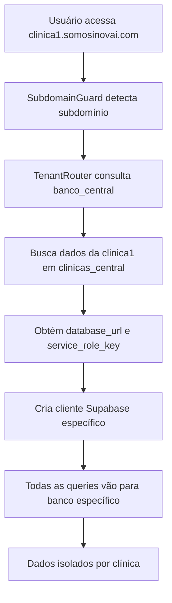

# 🏢 EXPLICAÇÃO COMPLETA DO SISTEMA MULTI-TENANT

## 📋 ÍNDICE
1. [Visão Geral do Sistema](#visão-geral-do-sistema)
2. [Como o Sistema Encontra Bancos de Clínicas](#como-o-sistema-encontra-bancos-de-clínicas)
3. [Fluxo de Dados Completo](#fluxo-de-dados-completo)
4. [Arquitetura Database-per-Tenant](#arquitetura-database-per-tenant)
5. [Processo de Criação de Nova Clínica](#processo-de-criação-de-nova-clínica)
6. [Configuração DNS e Hostinger](#configuração-dns-e-hostinger)

---

## 🎯 VISÃO GERAL DO SISTEMA

### Conceito Multi-Tenant
O sistema utiliza a arquitetura **Database-per-Tenant**, onde:
- **1 Banco Central**: Gerencia todas as clínicas e metadados
- **N Bancos de Clínicas**: Cada clínica tem seu próprio banco de dados isolado

### Componentes Principais
```
┌─────────────────┐    ┌─────────────────┐    ┌─────────────────┐
│   BANCO CENTRAL │    │  BANCO CLÍNICA-1│    │  BANCO CLÍNICA-N│
│                 │    │                 │    │                 │
│ - clinicas_     │    │ - agendamentos  │    │ - agendamentos  │
│   central       │    │ - pacientes     │    │ - pacientes     │
│ - planos_       │    │ - medicos       │    │ - medicos       │
│   sistema       │    │ - funcionarios  │    │ - funcionarios  │
│ - logs_sistema  │    │ - exames        │    │ - exames        │
└─────────────────┘    └─────────────────┘    └─────────────────┘
```

---

## 🔍 COMO O SISTEMA ENCONTRA BANCOS DE CLÍNICAS

### 1. **Detecção do Subdomínio**

#### Componente: `SubdomainGuard.tsx`
```typescript
// Detecta o subdomínio da URL atual
const hostname = window.location.hostname; // Ex: clinica1.somosinovai.com
const parts = hostname.split('.');
const subdomain = parts[0]; // Extrai "clinica1"
```

#### Lógica de Detecção:
- **Desenvolvimento**: `localhost` → Permite acesso livre
- **Preview Lovable**: `lovable.app` → Permite acesso livre  
- **Produção**: `*.somosinovai.com` → Extrai subdomínio obrigatório

### 2. **Consulta ao Banco Central**

#### Componente: `TenantRouter.tsx`
```typescript
// Busca configuração da clínica no banco central
const { data: clinicaConfig } = await adminSupabase
  .from('clinicas_central')
  .select('*')
  .eq('subdominio', subdomain) // clinica1
  .single();
```

#### Informações Retornadas:
```json
{
  "id": "uuid-da-clinica",
  "nome": "Clínica São João",
  "subdominio": "clinica1", 
  "database_name": "clinica_clinica1",
  "database_url": "https://tgydss...supabase.co",
  "service_role_key": "eyJhbGc...",
  "status": "ativa"
}
```

### 3. **Criação do Cliente Específico**

#### Função: `createClinicClient()`
```typescript
export const createClinicClient = (subdominio: string) => {
  const config = CLINIC_DATABASES[subdominio];
  
  return createClient<Database>(config.url, config.key, {
    auth: {
      storage: localStorage,
      persistSession: false,
      autoRefreshToken: false,
    }
  });
};
```

### 4. **Roteamento de Dados**

#### Hook: `useTenant()`
```typescript
const { tenantId, clinicaId, databaseClient } = useTenant();

// Todas as consultas usam o cliente específico da clínica
const { data: pacientes } = useQuery({
  queryKey: ['pacientes', tenantId],
  queryFn: () => databaseClient.from('pacientes').select('*')
});
```

---

## 🌊 FLUXO DE DADOS COMPLETO

### Passo a Passo Detalhado:



### 1. **Acesso Inicial**
```
Usuário → clinica1.somosinovai.com
```

### 2. **Detecção**
```typescript
// SubdomainGuard.tsx
const subdomain = "clinica1"; // Extraído da URL
```

### 3. **Consulta Central**
```sql
-- Query no banco_central
SELECT * FROM clinicas_central WHERE subdominio = 'clinica1';
```

### 4. **Resposta do Central**
```json
{
  "database_url": "https://tgydssyqgmifcuajacgo.supabase.co",
  "service_role_key": "eyJ...",
  "database_name": "clinica_clinica1"
}
```

### 5. **Criação do Cliente**
```typescript
const clinicClient = createClient(
  "https://tgydssyqgmifcuajacgo.supabase.co",
  "eyJ..."
);
```

### 6. **Queries da Aplicação**
```typescript
// Agora todas as queries vão para o banco específico da clinica1
const pacientes = clinicClient.from('pacientes').select('*');
```

---

## 🏗️ ARQUITETURA DATABASE-PER-TENANT

### Vantagens:
✅ **Isolamento Total**: Dados de uma clínica nunca se misturam com outra  
✅ **Segurança Máxima**: Impossível acessar dados de clínica errada  
✅ **Performance**: Cada banco otimizado para sua clínica  
✅ **Personalização**: Esquemas podem ser diferentes por clínica  
✅ **Backup Granular**: Backup individual por clínica  

### Estrutura Atual:

#### Banco Central (banco_central)
- **Função**: Catálogo e gerenciamento
- **URL**: `biihsfrunulliloaaxju.supabase.co`
- **Tabelas**:
  - `clinicas_central` - Lista de todas as clínicas
  - `planos_sistema` - Planos disponíveis
  - `logs_sistema` - Logs do sistema
  - `configuracoes_sistema` - Configurações globais

#### Bancos de Clínicas (Específicos)
- **Função**: Dados operacionais de cada clínica
- **URL**: `tgydssyqgmifcuajacgo.supabase.co` (compartilhado por agora)
- **Tabelas**:
  - `agendamentos` - Consultas da clínica
  - `pacientes` - Pacientes da clínica
  - `medicos` - Médicos da clínica
  - `funcionarios` - Funcionários da clínica
  - `exames` - Exames da clínica

---

## 👥 PROCESSO DE CRIAÇÃO DE NOVA CLÍNICA

### 1. **Cadastro Inicial (NovaClinica.tsx)**
```typescript
// Usuário preenche formulário
const formData = {
  nomeClinica: "Clínica São Pedro",
  subdominio: "clinicasaopedro",
  emailResponsavel: "admin@clinicasaopedro.com",
  senhaPersonalizada: "senha123456"
};
```

### 2. **Validação de Subdomínio**
```typescript
// Verifica se subdomínio já existe
const { data: existingClinica } = await supabase
  .from('clinicas_central')
  .select('id')
  .eq('subdominio', 'clinicasaopedro')
  .single();

if (existingClinica) {
  throw new Error('Subdomínio já existe');
}
```

### 3. **Criação no Banco Central**
```typescript
// Insere nova clínica no banco_central
const { data: novaClinica } = await supabase
  .from('clinicas_central')
  .insert({
    nome: "Clínica São Pedro",
    subdominio: "clinicasaopedro", 
    database_name: "clinica_clinicasaopedro",
    database_url: "banco_modelo", // Referência ao modelo
    configuracoes: {
      senha_hash: hashedPassword,
      responsavel: "Dr. Pedro"
    }
  });
```

### 4. **Clonagem do Banco Modelo (MANUAL)**
> ⚠️ **PROCESSO ATUAL É MANUAL**

#### Passos Manuais:
1. **Acessar Supabase Dashboard**
2. **Criar novo projeto** para a clínica
3. **Copiar schema** do `banco_modelo`
4. **Configurar RLS** e políticas
5. **Atualizar configurações** em `clinicas_central`

#### Comando de Clonagem (Futuro):
```bash
# Script automático (em desenvolvimento)
./scripts/clone-clinic-database.sh "clinicasaopedro"
```

### 5. **Configuração DNS (MANUAL)**
> ⚠️ **PROCESSO ATUAL É MANUAL**

#### Hostinger - Passos:
1. **Acessar Painel Hostinger**
2. **Gerenciar Domínio** `somosinovai.com`
3. **Adicionar Subdomínio** `clinicasaopedro`
4. **Apontar para** IP do servidor

---

## 🌐 CONFIGURAÇÃO DNS E HOSTINGER

### Status Atual:
- **Domínio Principal**: `somosinovai.com` ✅
- **Wildcard DNS**: `*.somosinovai.com` ❌ (Manual)
- **Subdomínios Ativos**: 
  - `bancomodelo.somosinovai.com` ✅
  - `clinica1.somosinovai.com` ✅

### Configuração Necessária na Hostinger:

#### 1. **Wildcard DNS (Automático)**
```dns
Type: A
Name: *
Value: 185.158.133.1
TTL: 14400
```

#### 2. **Subdomínios Específicos (Manual)**
```dns
Type: A  
Name: clinicasaopedro
Value: 185.158.133.1
TTL: 14400
```

### Processo de Adição Manual:

#### No Painel Hostinger:
1. **Login** → Painel de Controle
2. **Domínios** → Gerenciar `somosinovai.com`
3. **Zona DNS** → Adicionar Registro
4. **Tipo**: A Record
5. **Nome**: `clinicasaopedro`
6. **Valor**: `185.158.133.1`
7. **Salvar** e aguardar propagação (até 24h)

### Automação Futura:
```typescript
// API da Hostinger (em desenvolvimento)
const adicionarSubdominio = async (subdominio: string) => {
  const response = await fetch('https://api.hostinger.com/dns/records', {
    method: 'POST',
    headers: {
      'Authorization': 'Bearer ' + HOSTINGER_API_KEY,
    },
    body: JSON.stringify({
      type: 'A',
      name: subdominio,
      content: '185.158.133.1'
    })
  });
};
```

---

## 🔧 O QUE FAZER PARA ADICIONAR NOVA CLÍNICA

### Processo Completo Atual:

#### 1. **Cadastro via Interface** ✅ (Automático)
- Acessar `/nova-clinica`
- Preencher formulário completo
- Sistema valida e salva em `clinicas_central`

#### 2. **Criar Banco Específico** ❌ (Manual)
```bash
# No Supabase Dashboard:
1. Criar novo projeto Supabase
2. Copiar SQL do banco_modelo
3. Executar migrations
4. Configurar RLS
5. Obter URL e service_role_key
6. Atualizar clinicas_central com as novas informações
```

#### 3. **Configurar DNS na Hostinger** ❌ (Manual)
```bash
# No Painel Hostinger:
1. Acessar Zona DNS de somosinovai.com
2. Adicionar registro A:
   - Nome: [subdominio-da-clinica]
   - Tipo: A
   - Valor: 185.158.133.1
3. Aguardar propagação DNS
```

#### 4. **Atualizar Configurações** ❌ (Manual)
```sql
-- Atualizar banco_central com dados reais
UPDATE clinicas_central 
SET 
  database_url = 'https://nova-url-especifica.supabase.co',
  service_role_key = 'nova-chave-especifica',
  status = 'ativa'
WHERE subdominio = 'nova-clinica';
```

#### 5. **Testar Acesso** ✅ (Automático)
- Acessar `nova-clinica.somosinovai.com`
- Sistema deve redirecionar automaticamente
- Login com credenciais criadas

### Automação Necessária:

#### Para Automação Completa:
1. **API Supabase** - Criação automática de projetos
2. **API Hostinger** - Criação automática de DNS
3. **Scripts de Deploy** - Configuração automática
4. **Webhook de Confirmação** - Validação automática

---

## 📚 RESUMO PARA INICIANTES

### Em Linguagem Simples:

1. **Sistema Central = Catálogo Telefônico**
   - Sabe onde cada clínica "mora" (qual banco usar)

2. **Bancos de Clínicas = Casas Separadas**  
   - Cada clínica tem sua própria "casa" (banco de dados)
   - Impossível uma clínica ver dados de outra

3. **Subdomínio = Endereço da Casa**
   - `clinica1.somosinovai.com` = Endereço da Clínica 1
   - `clinica2.somosinovai.com` = Endereço da Clínica 2

4. **Fluxo Simples**:
   - Usuário acessa endereço específico
   - Sistema consulta "catálogo" para saber qual "casa" usar  
   - Direciona todas as operações para "casa" correta
   - Dados ficam 100% isolados e seguros

### Benefícios:
- ✅ **Segurança Total**: Impossível vazamento entre clínicas
- ✅ **Performance**: Cada clínica só lida com seus dados
- ✅ **Escalabilidade**: Pode adicionar infinitas clínicas
- ✅ **Personalização**: Cada clínica pode ter configurações únicas
- ✅ **Conformidade**: LGPD e regulamentações médicas

---

*Documentação criada em: $(date)  
Sistema: Plataforma Médica Multi-Tenant  
Versão: 1.0*