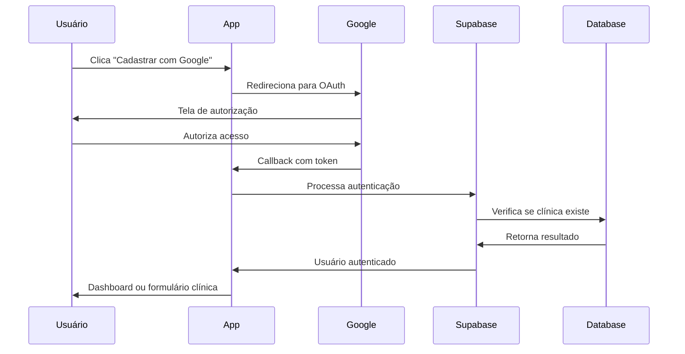

# 🔐 Configuração Completa - Google Authentication para www.somosinovai.com

## ⚠️ IMPORTANTE: LEIA ATENTAMENTE ANTES DE COMEÇAR
Este tutorial é para iniciantes que NUNCA configuraram Google Auth. Siga EXATAMENTE na ordem.

## 📋 1. CONFIGURAÇÃO NO GOOGLE CLOUD CONSOLE

### 1.1. Criar/Configurar Projeto (Passo a Passo)
1. **Acesse**: https://console.cloud.google.com
2. **Se for primeira vez**: 
   - Clique em "Create Project" no canto superior direito
   - Se já tiver projetos: clique no nome do projeto atual (no topo) → "New Project"
3. **Nome do projeto**: "Sistema Clinicas Inovai"
4. **Organization**: deixe em branco se não tiver
5. **Location**: deixe em branco
6. Clique **"CREATE"**
7. **AGUARDE** o projeto ser criado (pode demorar 1-2 minutos)
8. **CERTIFIQUE-SE** que o projeto está selecionado no topo da tela

### 1.2. Configurar Tela de Consentimento (OBRIGATÓRIO)
1. **No menu lateral esquerdo**, procure por **"APIs & Services"**
2. Clique em **"OAuth consent screen"**
3. **Escolha "External"** (para usuários externos poderem usar)
4. Clique **"CREATE"**
5. **Preencha OBRIGATORIAMENTE**:
   - **App name**: "Sistema de Gestão de Clínicas INOVAI"
   - **User support email**: seu-email@gmail.com (use o mesmo email que você usa no Google)
   - **App logo**: pode pular por enquanto
   - **App domain**: deixe em branco por enquanto
   - **Authorized domains**: 
     - Clique em **"ADD DOMAIN"**
     - Digite: `somosinovai.com` (SEM www, SEM https)
     - Clique em **"ADD DOMAIN"** novamente
     - Digite: `supabase.co`
     - **ATENÇÃO**: Use APENAS os domínios exatos acima
   - **Developer contact**: mesmo email de suporte
6. Clique **"SAVE AND CONTINUE"**
7. **Na tela "Scopes"**: clique **"SAVE AND CONTINUE"** (sem adicionar nada)
8. **Na tela "Test users"**: clique **"SAVE AND CONTINUE"** (pode pular)
9. **Na tela "Summary"**: clique **"BACK TO DASHBOARD"**

### 1.3. Criar Credenciais OAuth 2.0
1. **No menu lateral**, clique em **"Credentials"**
2. **No topo da tela**, clique **"+ CREATE CREDENTIALS"**
3. Escolha **"OAuth 2.0 Client IDs"**
4. **Application type**: selecione **"Web application"**
5. **Name**: "Sistema Clinicas Web INOVAI"

### 1.4. URLs EXATAS para www.somosinovai.com
**⚠️ COPIE EXATAMENTE - UM ERRO AQUI E NÃO FUNCIONA**

**Authorized JavaScript origins** (clique "+ ADD URI" para cada):
```
http://localhost:3000
https://www.somosinovai.com
https://somosinovai.com
```

**Authorized redirect URIs** (clique "+ ADD URI"):
```
https://sxtqlnayloetwlcjtkbj.supabase.co/auth/v1/callback
```

6. Clique **"CREATE"**
7. **GUARDE**: Uma tela aparecerá com **Client ID** e **Client Secret**
   - **Client ID**: começa com números e termina com `.apps.googleusercontent.com`
   - **Client Secret**: uma string aleatória
   - **⚠️ COPIE E COLE EM UM ARQUIVO DE TEXTO - VOCÊ VAI PRECISAR**

---

## 🔧 2. CONFIGURAÇÃO NO SUPABASE

### 2.1. Habilitar Provider Google
1. **Acesse**: https://supabase.com/dashboard/project/sxtqlnayloetwlcjtkbj/auth/providers
2. Clique em **"Google"**
3. **Habilite** o provider
4. Cole as credenciais:
   - **Client ID**: (do Google Console)
   - **Client Secret**: (do Google Console)

### 2.2. Configurar URLs EXATAS no Supabase para www.somosinovai.com
1. **Acesse**: https://supabase.com/dashboard/project/sxtqlnayloetwlcjtkbj/auth/url-configuration
2. **Site URL** (APENAS UM - o principal):
   ```
   https://www.somosinovai.com
   ```
3. **Redirect URLs** (cole EXATAMENTE - um por linha):
   ```
   https://www.somosinovai.com/dashboard ""ok"""
   https://www.somosinovai.com/nova-clinica ""FALTA"""
   https://somosinovai.com/dashboard  ""FALTA"""
   https://somosinovai.com/nova-clinica  ""FALTA"""
   http://localhost:3000/dashboard  ""FALTA"""
   http://localhost:3000/nova-clinica  ""FALTA"""
   ```
4. **⚠️ CLIQUE "SAVE" - se não salvar, não funcionará**

 **⚠️ Caso nao funcione, fazer função curinga

✅ Solução: Usando Curingas (Wildcards)
Para resolver o problema, substitua a lista extensa de URLs de redirecionamento por estas duas linhas que utilizam o caractere * como curinga:

Acesse a área de configuração de URLs no seu projeto Supabase:
https://supabase.com/dashboard/project/sxtqlnayloetwlcjtkbj/auth/url-configuration

No campo Redirect URLs, apague as linhas atuais e adicione as seguintes:

https://*.somosinovai.com/*
http://localhost:3000/*
Clique em "Save" para aplicar as alterações.

Explicação dos Curingas Utilizados:
https://*.somosinovai.com/*

O * no subdomínio (*.somosinovai.com) cobre tanto www.somosinovai.com quanto somosinovai.com (o domínio raiz).

O * no final da URL (/*) cobre qualquer caminho após o domínio, como /dashboard, /nova-clinica e qualquer outra página que você venha a criar.

http://localhost:3000/*

Este padrão cobre todas as páginas do seu ambiente de desenvolvimento local na porta 3000, como /dashboard e /nova-clinica.

Resumo da Configuração Final
Sua configuração de URL no Supabase deve ficar assim:

Site URL:

https://www.somosinovai.com
Redirect URLs:

https://*.somosinovai.com/*
http://localhost:3000/*
Dessa forma, você resolve o erro de "muitos URLs", torna sua configuração mais limpa e garante que tanto o ambiente de produção (com e sem www) quanto o de desenvolvimento local funcionem corretamente para a autenticação do Google.
---*/

## 💻 3. IMPLEMENTAÇÃO NO CÓDIGO

### 3.1. Hook useGoogleAuth.tsx
```typescript
// Localização: src/hooks/useGoogleAuth.tsx
export const useGoogleAuth = () => {
  const signInWithGoogle = async () => {
    const { data, error } = await supabase.auth.signInWithOAuth({
      provider: 'google',
      options: {
        redirectTo: `${window.location.origin}/dashboard`,
        queryParams: {
          access_type: 'offline',
          prompt: 'consent',
        },
      }
    });
  };

  const signUpWithGoogle = async (clinicData: any) => {
    // Implementação para cadastro com dados da clínica
  };
};
```

### 3.2. Integração nas Páginas
```typescript
// Em src/pages/ClinicaLogin.tsx
import { useGoogleAuth } from '@/hooks/useGoogleAuth';

const { signInWithGoogle, loading } = useGoogleAuth();

// Botão Google Login
<Button onClick={signInWithGoogle} disabled={loading}>
  Entrar com Google
</Button>
```

---

## 🏥 4. FLUXO DE CADASTRO COM GOOGLE

### 4.1. Processo Completo


### 4.2. Verificação de Clínica Existente
```typescript
// Após login com Google, verificar se clínica já existe
const { data: clinica } = await supabase
  .from('clinicas')
  .select('*')
  .eq('email', user.email)
  .single();

if (!clinica) {
  // Redirecionar para formulário de nova clínica
  navigate('/nova-clinica?step=complete');
} else {
  // Clínica existe, ir para dashboard
  navigate('/dashboard');
}
```

---

## 📱 5. CONFIGURAÇÃO PARA DIFERENTES AMBIENTES

### 5.1. Desenvolvimento Local
```typescript
// URLs para desenvolvimento
const redirectTo = 'http://localhost:3000/dashboard';
```

### 5.2. Produção (Vercel)
```typescript
// URLs para produção
const redirectTo = 'https://sua-app.vercel.app/dashboard';
```

### 5.3. Domínio Personalizado
```typescript
// URLs para domínio próprio
const redirectTo = 'https://seudominio.com/dashboard';
```

---

## 🔍 6. TROUBLESHOOTING GOOGLE AUTH

### 6.1. Erro: "redirect_uri_mismatch"
**Solução**:
1. Verificar se URL está correta no Google Console
2. Certificar que protocolo (https/http) está correto
3. Não deve ter barras extras no final

### 6.2. Erro: "access_denied"
**Solução**:
1. Verificar se app está em modo produção no Google
2. Adicionar email de teste na lista de usuários de teste
3. Verificar se domínio está autorizado

### 6.3. Erro: "invalid_client"
**Solução**:
1. Verificar Client ID e Secret no Supabase
2. Certificar que credenciais não expiraram
3. Recriar credenciais se necessário

### 6.4. Usuário Não Consegue Logar
**Verificações**:
```typescript
// Debug no console
console.log('User:', user);
console.log('Session:', session);
console.log('Error:', error);
```

---

## 🚀 7. IMPLEMENTAÇÃO COMPLETA

### 7.1. Arquivos Criados/Modificados
```
✅ src/hooks/useGoogleAuth.tsx        # Hook principal
✅ src/pages/ClinicaLogin.tsx         # Login com Google
✅ src/pages/Index.tsx                # Cadastro com Google
✅ src/pages/NovaClinica.tsx          # Completar dados pós-Google
```

### 7.2. Funcionalidades Implementadas
- ✅ Login com Google para clínicas existentes
- ✅ Cadastro com Google para novas clínicas
- ✅ Redirecionamento automático pós-auth
- ✅ Tratamento de erros completo
- ✅ Loading states e feedback visual

---

## 📊 8. MONITORAMENTO E MÉTRICAS

### 8.1. Logs Importantes
```sql
-- Verificar logins com Google
SELECT * FROM auth.users 
WHERE provider = 'google' 
AND created_at > NOW() - INTERVAL '24 hours';

-- Clínicas criadas via Google
SELECT c.*, u.email as google_email 
FROM clinicas c
JOIN auth.users u ON c.user_id = u.id
WHERE u.provider = 'google';
```

### 8.2. Métricas para Acompanhar
- Taxa de conversão Google vs Email/Senha
- Tempo médio de onboarding
- Abandono no processo de cadastro
- Erros de autenticação por tipo

---

## 🎯 9. PRÓXIMAS MELHORIAS

1. ✅ **Multi-provider**: Facebook, Apple, Microsoft
2. ✅ **SSO Empresarial**: SAML, OIDC
3. ✅ **Autenticação 2FA**: Para segurança extra
4. ✅ **Login social linking**: Conectar contas existentes
5. ✅ **Audit trail**: Log de todas as autenticações

---

*Documentação atualizada em: Janeiro 2025*