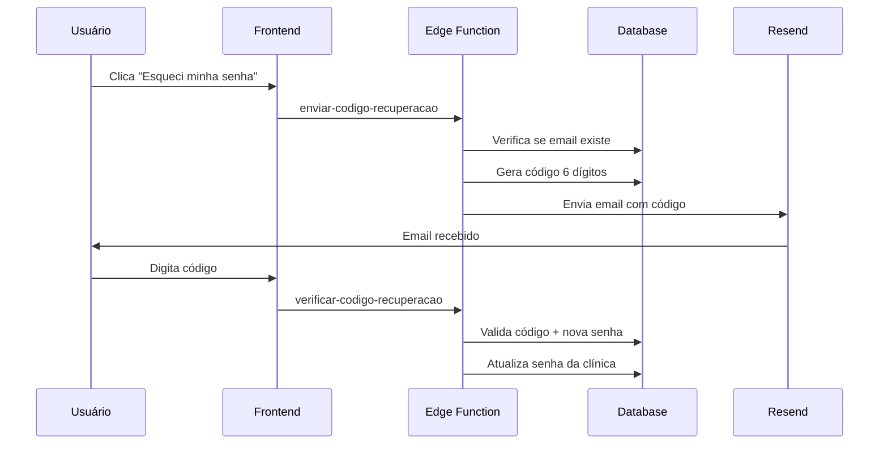

# 📧 Documentação Completa - Sistema de Emails para www.somosinovai.com

## ⚠️ IMPORTANTE: TUTORIAL PARA INICIANTES
Este guia é para quem NUNCA configurou sistema de emails. Siga EXATAMENTE na ordem.

## 🔧 1. CONFIGURAÇÃO DA API RESEND (Passo a Passo)

### 1.1. Criar conta no Resend (OBRIGATÓRIO)
1. **Acesse**: https://resend.com
2. **Clique em "Get Started"** no canto superior direito
3. **Cadastre-se** com seu email (use o mesmo email do seu domínio se possível)
4. **Confirme seu email** (verifique a caixa de spam também)
5. **Faça login** na conta criada

### 1.2. Validar seu domínio www.somosinovai.com (OBRIGATÓRIO)
1. **Após login**, vá para: https://resend.com/domains
2. **Clique em "Add Domain"**
3. **Digite EXATAMENTE**: `somosinovai.com` (SEM www, SEM https)
4. **Clique "Add Domain"**
5. **ATENÇÃO**: O Resend mostrará registros DNS que você DEVE adicionar:
   - **MX Record**: Para receber emails
   - **TXT Record**: Para verificação
   - **CNAME Record**: Para tracking
6. **⚠️ IMPORTANTE**: Você deve adicionar esses registros no seu provedor de domínio (onde comprou o domínio)
7. **Aguarde a verificação** (pode demorar até 24 horas)
8. **Status deve ficar "Verified"** antes de prosseguir

### 1.3. Criar API Key (Depois da verificação do domínio)
1. **Vá para**: https://resend.com/api-keys
2. **Clique em "Create API Key"**
3. **Nome**: "Sistema Clinicas INOVAI"
4. **Permission**: deixe "Full access" selecionado
5. **Domain**: selecione `somosinovai.com`
6. **Clique "Add"**
7. **⚠️ COPIE A API KEY**: começa com `re_` e tem uma sequência longa
8. **GUARDE EM LOCAL SEGURO**: você só verá uma vez

### 1.4. Configurar API Key no Supabase (OBRIGATÓRIO)
1. **Acesse**: https://supabase.com/dashboard/project/sxtqlnayloetwlcjtkbj/settings/functions
2. **Clique em "Add new secret"**
3. **Nome**: `RESEND_API_KEY` (EXATAMENTE assim, com maiúsculas)
4. **Valor**: Cole a API key que você copiou (ex: `re_xxxxxxxxx`)
5. **⚠️ CLIQUE "Add secret"** - se não salvar, emails não funcionarão

---

## 🏥 2. COMO FUNCIONA O SISTEMA DE EMAILS

### 2.1. Estrutura Geral
O sistema usa **UMA ÚNICA API** do Resend para todos os tipos de email:
- ✅ **Lembretes de consulta** (por clínica)
- ✅ **Recuperação de senha** (sistema global)
- ✅ **Notificações de vencimento** (sistema global)

### 2.2. Personalização por Clínica
```typescript
// Cada clínica pode personalizar:
- remetente_nome: "Nome da Clínica"
- remetente_email: "contato@clinica.com" 
- assunto_email: "Lembrete personalizado"
- template_personalizado: "HTML customizado"
```

### 2.3. Edge Functions Criadas
```
supabase/functions/enviar-lembretes-email/      # Lembretes automáticos
supabase/functions/enviar-codigo-recuperacao/   # Códigos de recuperação
supabase/functions/verificar-codigo-recuperacao/ # Verificação de códigos
```

---

## 🔐 3. SISTEMA DE RECUPERAÇÃO DE SENHA

### 3.1. Fluxo Completo


### 3.2. Tabela de Códigos de Recuperação
```sql
CREATE TABLE codigos_recuperacao (
  id UUID PRIMARY KEY DEFAULT gen_random_uuid(),
  clinica_id UUID NOT NULL,
  email TEXT NOT NULL,
  codigo TEXT NOT NULL,
  expira_em TIMESTAMP WITH TIME ZONE NOT NULL,
  usado BOOLEAN NOT NULL DEFAULT false,
  created_at TIMESTAMP WITH TIME ZONE DEFAULT now()
);
```

### 3.3. Arquivos Envolvidos
```
src/components/PasswordResetModal.tsx     # Modal de recuperação
src/pages/ClinicaLogin.tsx               # Botão "Esqueci senha"
supabase/functions/enviar-codigo-recuperacao/
supabase/functions/verificar-codigo-recuperacao/
```

---

## 🚀 4. CONFIGURAÇÃO DO GOOGLE AUTH

### 4.1. Configurar no Google Cloud Console
1. Acesse: https://console.cloud.google.com
2. Crie um projeto ou selecione existente
3. Vá em "APIs & Services" > "Credentials"
4. Clique "Create Credentials" > "OAuth 2.0 Client IDs"
5. Tipo: "Web application"
6. JavaScript origins: `https://sua-app.vercel.app`
7. Redirect URIs: `https://sxtqlnayloetwlcjtkbj.supabase.co/auth/v1/callback`

### 4.2. Configurar no Supabase
1. Acesse: https://supabase.com/dashboard/project/sxtqlnayloetwlcjtkbj/auth/providers
2. Habilite "Google"
3. Cole Client ID e Client Secret
4. Configure Site URL e Redirect URLs

### 4.3. Arquivos do Google Auth
```
src/hooks/useGoogleAuth.tsx              # Hook principal
src/pages/ClinicaLogin.tsx               # Botão Google Login
src/pages/Index.tsx                      # Botão Google Signup
```

### 4.4. Fluxo de Cadastro com Google
```typescript
1. Usuário clica "Entrar com Google"
2. Redirecionado para Google OAuth
3. Após autorização, volta para app
4. Sistema verifica se clínica já existe
5. Se não existir, cria nova clínica automaticamente
6. Usuário é direcionado para dashboard
```

---

## 📊 5. CONFIGURAÇÕES POR CLÍNICA

### 5.1. Configuração de Emails (Tabela: configuracoes_email)
```sql
INSERT INTO configuracoes_email (
  clinica_id,
  remetente_nome,
  remetente_email,
  assunto_email,
  template_personalizado,
  horas_antecedencia,
  horario_envio
) VALUES (
  'clinic-uuid',
  'Clínica Exemplo',
  'contato@clinicaexemplo.com',
  'Lembrete: Consulta agendada para amanhã',
  '<html>Template personalizado...</html>',
  24,
  '18:00:00'
);
```

### 5.2. Como Cada Clínica Usa a Mesma API
- ✅ **Isolamento**: Cada clínica tem suas configurações
- ✅ **Personalização**: Nome, email, template próprios
- ✅ **Economia**: Uma única API para todas as clínicas
- ✅ **Escalabilidade**: Suporta milhares de clínicas

---

## 🔧 6. COMANDOS ÚTEIS

### 6.1. Testar Edge Function
```bash
# Via cURL
curl -X POST 'https://sxtqlnayloetwlcjtkbj.supabase.co/functions/v1/enviar-codigo-recuperacao' \
  -H 'Content-Type: application/json' \
  -d '{"email": "test@clinica.com"}'
```

### 6.2. Verificar Logs
- Acesse: https://supabase.com/dashboard/project/sxtqlnayloetwlcjtkbj/functions/enviar-codigo-recuperacao/logs

### 6.3. Limpar Códigos Expirados
```sql
-- Executar diariamente
SELECT limpar_codigos_expirados();
```

---

## ⚠️ 7. TROUBLESHOOTING

### 7.1. Email não está sendo enviado
1. ✅ Verificar se RESEND_API_KEY está configurada
2. ✅ Verificar se domínio está validado no Resend
3. ✅ Verificar logs da Edge Function
4. ✅ Verificar se email existe na tabela clinicas

### 7.2. Google Auth não funciona
1. ✅ Verificar Client ID e Secret no Supabase
2. ✅ Verificar Redirect URLs no Google Console
3. ✅ Verificar Site URL no Supabase
4. ✅ Testar em modo incógnito

### 7.3. Código de recuperação inválido
1. ✅ Verificar se código não expirou (15 minutos)
2. ✅ Verificar se código não foi usado
3. ✅ Verificar se email confere

---

## 📈 8. MONITORAMENTO

### 8.1. Métricas Importantes
- Taxa de entrega de emails
- Tempo de resposta das Edge Functions
- Códigos expirados vs utilizados
- Login com Google vs email/senha

### 8.2. Logs para Acompanhar
```sql
-- Códigos de recuperação
SELECT * FROM codigos_recuperacao 
WHERE created_at > NOW() - INTERVAL '24 hours';

-- Emails enviados
SELECT * FROM email_lembretes 
WHERE created_at > NOW() - INTERVAL '24 hours';
```

---

## 🎯 9. PRÓXIMOS PASSOS

1. ✅ **Implementar rate limiting** para códigos de recuperação
2. ✅ **Adicionar templates de email** mais bonitos
3. ✅ **Implementar webhooks** do Resend para tracking
4. ✅ **Adicionar autenticação 2FA** opcional
5. ✅ **Dashboard de métricas** de email

---

*Documentação criada em: Janeiro 2025*
*Versão: 1.0*