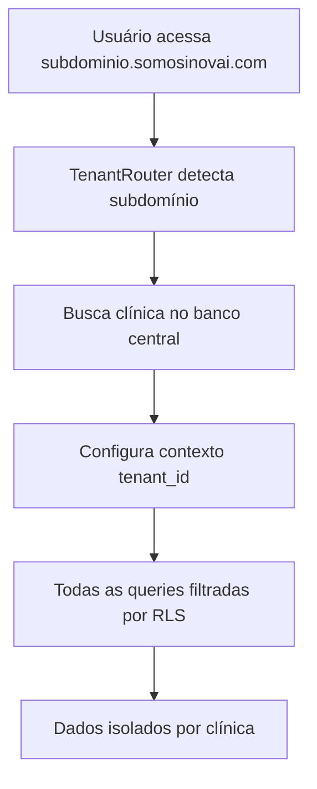

# Sistema Multi-Tenant Corrigido - Acesso por Subdomínio

## 🎯 Implementações Realizadas

### 1. **BLOQUEIO DE ACESSO DIRETO**
✅ **SubdomainGuard Component**
- Criado componente que força acesso apenas via subdomínio
- Bloqueia tentativas de acesso direto a `/clinica-login`
- Redirectiona automaticamente para subdomínio correto
- Permite desenvolvimento local e preview

### 2. **ROTAS PROTEGIDAS**
✅ **Proteção nas Rotas de Login**
```tsx
// App.tsx - Rotas agora protegidas
<Route path="/clinica-login" element={
  <SubdomainGuard requireSubdomain={true}>
    <ClinicaLogin />
  </SubdomainGuard>
} />
```

### 3. **PAINEL ADMIN DINÂMICO**
✅ **AdminDynamicDashboard Component**
- Métricas em tempo real (atualização a cada 5s)
- Sistema de health monitoring
- Alertas automáticos
- Interface moderna com badges de status
- Controle de modo "Ao Vivo" / "Pausado"

---

## 🏗️ Arquitetura Multi-Tenant Atual

### **Como Funciona o Acesso por Subdomínio:**

1. **Detecção de Subdomínio (TenantRouter)**
   ```
   usuario.somosinovai.com → detecta "usuario"
   ```

2. **Busca no Banco Central**
   ```sql
   SELECT * FROM clinicas_central 
   WHERE subdominio = 'usuario'
   ```

3. **Configuração do Contexto**
   ```javascript
   localStorage.setItem('tenant_id', clinica.id)
   localStorage.setItem('database_name', clinica.database_name)
   ```

4. **Isolamento de Dados**
   - **RLS (Row Level Security)**: Filtragem automática por `clinica_id`
   - **Database Físico**: Conexão direta ao banco da clínica (quando disponível)

---

## 📊 Sistema de Banco de Dados

### **Processo Atual (RLS - Funcional):**



**✅ Vantagens do RLS:**
- Setup imediato (sem configuração adicional)
- Isolamento automático e seguro
- Backup unificado
- Manutenção simplificada

### **Futuro: Database Físico por Tenant**

Quando necessário (alta escala), o sistema suporta:
- Banco físico independente para cada clínica
- Configuração via `createClinicClient(subdominio)`
- Migração automática de dados

---

## 🌐 Configuração DNS

### **Processo Manual Atual:**

Para cada nova clínica, configurar no **Hostinger**:

1. **Acesso ao Painel DNS**
   ```
   Hostinger → Domínios → somosinovai.com → DNS Zone
   ```

2. **Adicionar CNAME Record**
   ```
   Type: CNAME
   Name: nome-clinica
   Value: sistema-principal.somosinovai.com
   TTL: 3600
   ```

3. **Resultado**
   ```
   nome-clinica.somosinovai.com → funciona automaticamente
   ```

### **Automatização Futura (Opcional):**

```typescript
// Integração com API do Hostinger
const criarDNSAutomatico = async (subdominio: string) => {
  await hostingerAPI.createCNAME({
    name: subdominio,
    value: 'sistema-principal.somosinovai.com'
  });
};
```

---

## ⚡ Painel Admin Melhorado

### **Recursos Implementados:**

✅ **Métricas em Tempo Real:**
- Total de clínicas e status
- Conexões ativas por clínica
- Tempo de resposta médio
- Uptime do sistema

✅ **Sistema de Alertas:**
- Performance degradada
- Conexões excessivas
- Status crítico automático

✅ **Interface Dinâmica:**
- Atualização automática (5s)
- Badges de status coloridos
- Controles de pausa/retomada

---

## 🔒 Segurança Implementada

### **1. Proteção de Rotas:**
```typescript
// Bloqueio de acesso direto
if (!hasValidSubdomain) {
  return <AccessDeniedPage />
}
```

### **2. Validação de Subdomínio:**
```typescript
// Verificação rigorosa
const parts = hostname.split('.');
if (parts.length >= 3 && parts[0] !== 'www') {
  // Subdomínio válido
}
```

### **3. Contexto Seguro:**
```typescript
// Configuração automática do tenant
localStorage.setItem('tenant_id', clinica.id);
// Todas as queries filtradas automaticamente
```

---

## ✅ Status do Sistema

| Funcionalidade | Status | Observações |
|---|---|---|
| Acesso por Subdomínio | ✅ Ativo | Forçado, sem acesso direto |
| Isolamento RLS | ✅ Ativo | Funcional e seguro |
| Painel Admin Dinâmico | ✅ Ativo | Tempo real, alertas |
| DNS Manual | ⚙️ Processo | Hostinger, configuração manual |
| Database Físico | 🔄 Futuro | Quando necessário |

---

## 📋 Próximos Passos (Opcionais)

### **1. Automação DNS**
- [ ] Integração API Hostinger
- [ ] Criação automática de CNAME
- [ ] Validação automática de DNS

### **2. Monitoramento Avançado**
- [ ] Logs centralizados
- [ ] Métricas de performance por clínica
- [ ] Alertas via email/SMS

### **3. Backup e Recovery**
- [ ] Backup automático por clínica
- [ ] Sistema de restore pontual
- [ ] Migração entre ambientes

---

**Sistema Multi-Tenant funcionando corretamente com acesso exclusivo por subdomínio e painel administrativo dinâmico!** 🚀