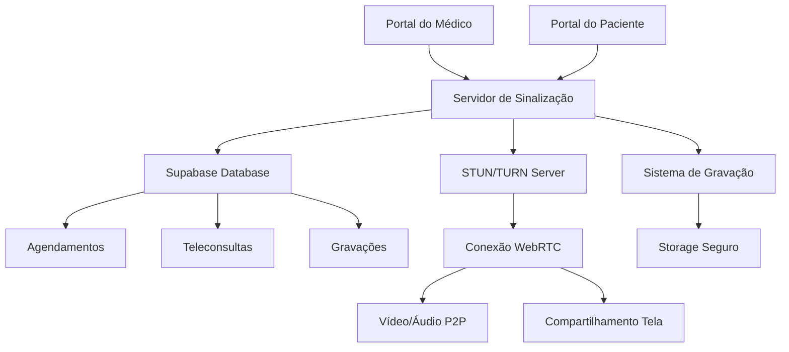

# Sistema de Telemedicina - Documentação Completa

## 🏥 Visão Geral

Esta documentação detalha como implementar um sistema completo de **telemedicina** integrado ao Unovai Exame Cloud, permitindo consultas por videoconferência entre médicos e pacientes com agendamento programado.

## 📋 Requisitos do Sistema

### Funcionalidades Principais
- ✅ **Agendamento de teleconsultas** com data/hora específica
- ✅ **Sala de vídeo exclusiva** para cada consulta
- ✅ **Portal do Médico** para iniciar consultas
- ✅ **Portal do Paciente** para participar das consultas
- ✅ **Gravação automática** das consultas (opcional)
- ✅ **Chat em tempo real** durante a consulta
- ✅ **Compartilhamento de tela** para exibir exames
- ✅ **Prescrição digital** durante a consulta
- ✅ **Histórico de teleconsultas** para ambos os usuários

### Requisitos Técnicos
- ✅ **WebRTC** para comunicação peer-to-peer
- ✅ **Socket.io** para sincronização em tempo real
- ✅ **STUN/TURN servers** para conectividade
- ✅ **Criptografia end-to-end** para segurança
- ✅ **Gravação no servidor** com armazenamento seguro

## 🏗️ Arquitetura Técnica

### Stack Tecnológico Recomendado

```bash
Frontend:
- React + TypeScript
- WebRTC APIs nativas
- Socket.io-client
- @mediapipe/camera_utils (para efeitos)

Backend:
- Supabase Edge Functions
- Socket.io server
- Agora.io ou Daily.co (SDK de vídeo)
- FFmpeg (para gravação)

Infraestrutura:
- STUN/TURN servers (Twilio/Agora)
- CDN para entrega de mídia
- Storage para gravações
```

### Diagrama de Arquitetura



## 🗄️ Estrutura do Banco de Dados

### Nova Tabela: `teleconsultas`

```sql
CREATE TABLE public.teleconsultas (
    id UUID PRIMARY KEY DEFAULT gen_random_uuid(),
    clinica_id UUID NOT NULL REFERENCES clinicas(id),
    agendamento_id UUID NOT NULL REFERENCES agendamentos(id),
    medico_id UUID NOT NULL REFERENCES medicos(id),
    paciente_id UUID NOT NULL REFERENCES pacientes(id),
    
    -- Configurações da Sala
    sala_id TEXT NOT NULL UNIQUE, -- ID único da sala de vídeo
    url_medico TEXT NOT NULL, -- URL específica para o médico
    url_paciente TEXT NOT NULL, -- URL específica para o paciente
    
    -- Controle de Status
    status TEXT NOT NULL DEFAULT 'agendada' CHECK (status IN (
        'agendada', 'iniciada', 'em_andamento', 'finalizada', 
        'cancelada', 'nao_compareceu_medico', 'nao_compareceu_paciente'
    )),
    
    -- Informações da Consulta
    data_inicio TIMESTAMP WITH TIME ZONE,
    data_fim TIMESTAMP WITH TIME ZONE,
    duracao_segundos INTEGER,
    
    -- Gravação
    gravacao_ativada BOOLEAN DEFAULT true,
    url_gravacao TEXT,
    senha_gravacao TEXT,
    
    -- Qualidade da Conexão
    qualidade_video_medico TEXT, -- 'excelente', 'boa', 'ruim'
    qualidade_video_paciente TEXT,
    problemas_conexao TEXT[],
    
    -- Dados da Consulta
    prescricoes_geradas UUID[], -- IDs das receitas criadas
    atestados_gerados UUID[], -- IDs dos atestados criados
    arquivos_compartilhados TEXT[], -- URLs dos arquivos
    
    -- Timestamps
    created_at TIMESTAMP WITH TIME ZONE DEFAULT now(),
    updated_at TIMESTAMP WITH TIME ZONE DEFAULT now()
);

-- Habilitar RLS
ALTER TABLE public.teleconsultas ENABLE ROW LEVEL SECURITY;

-- Política para isolamento por clínica
CREATE POLICY "Teleconsultas isoladas por clinica"
ON public.teleconsultas
FOR ALL
USING (clinica_id IN (
    SELECT clinicas.id FROM clinicas 
    WHERE clinicas.id = teleconsultas.clinica_id
));

-- Política para médicos acessarem suas teleconsultas
CREATE POLICY "Medicos podem acessar suas teleconsultas"
ON public.teleconsultas
FOR ALL
USING (medico_id IN (
    SELECT m.id FROM get_current_medico() m
));
```

### Tabela: `teleconsulta_participantes`

```sql
CREATE TABLE public.teleconsulta_participantes (
    id UUID PRIMARY KEY DEFAULT gen_random_uuid(),
    teleconsulta_id UUID NOT NULL REFERENCES teleconsultas(id),
    
    -- Informações do Participante
    tipo_participante TEXT NOT NULL CHECK (tipo_participante IN ('medico', 'paciente')),
    usuario_id UUID NOT NULL,
    
    -- Controle de Presença
    entrou_em TIMESTAMP WITH TIME ZONE,
    saiu_em TIMESTAMP WITH TIME ZONE,
    esta_online BOOLEAN DEFAULT false,
    
    -- Configurações de Mídia
    camera_ativada BOOLEAN DEFAULT true,
    microfone_ativado BOOLEAN DEFAULT true,
    tela_compartilhada BOOLEAN DEFAULT false,
    
    -- Qualidade da Conexão
    latencia_ms INTEGER,
    qualidade_audio TEXT,
    qualidade_video TEXT,
    
    created_at TIMESTAMP WITH TIME ZONE DEFAULT now()
);
```

### Tabela: `teleconsulta_mensagens`

```sql
CREATE TABLE public.teleconsulta_mensagens (
    id UUID PRIMARY KEY DEFAULT gen_random_uuid(),
    teleconsulta_id UUID NOT NULL REFERENCES teleconsultas(id),
    
    -- Remetente
    remetente_tipo TEXT NOT NULL CHECK (remetente_tipo IN ('medico', 'paciente', 'sistema')),
    remetente_id UUID,
    remetente_nome TEXT NOT NULL,
    
    -- Conteúdo
    mensagem TEXT NOT NULL,
    tipo_mensagem TEXT DEFAULT 'texto' CHECK (tipo_mensagem IN ('texto', 'arquivo', 'sistema')),
    arquivo_url TEXT,
    
    -- Timestamps
    enviada_em TIMESTAMP WITH TIME ZONE DEFAULT now(),
    visualizada_em TIMESTAMP WITH TIME ZONE
);
```

## 🚀 Implementação Passo a Passo

### 1. Configuração do Agendamento

```typescript
// Hook para criar teleconsulta
export const useTelemedicina = () => {
  const criarTeleconsulta = async (agendamentoId: string) => {
    const salaId = `sala_${Date.now()}_${Math.random().toString(36).substr(2, 9)}`;
    
    const { data, error } = await supabase
      .from('teleconsultas')
      .insert({
        agendamento_id: agendamentoId,
        sala_id: salaId,
        url_medico: `${window.location.origin}/telemedicina/medico/${salaId}`,
        url_paciente: `${window.location.origin}/telemedicina/paciente/${salaId}`,
        status: 'agendada'
      })
      .select()
      .single();
    
    return { data, error };
  };
};
```

### 2. Componente da Sala de Vídeo

```typescript
// components/TelemedicinaSala.tsx
import { useEffect, useRef, useState } from 'react';
import { io, Socket } from 'socket.io-client';

interface TelemedicinaSalaProps {
  salaId: string;
  tipoUsuario: 'medico' | 'paciente';
  usuarioId: string;
}

export const TelemedicinaSala = ({ salaId, tipoUsuario, usuarioId }: TelemedicinaSalaProps) => {
  const localVideoRef = useRef<HTMLVideoElement>(null);
  const remoteVideoRef = useRef<HTMLVideoElement>(null);
  const [socket, setSocket] = useState<Socket | null>(null);
  const [localStream, setLocalStream] = useState<MediaStream | null>(null);
  const [remoteStream, setRemoteStream] = useState<MediaStream | null>(null);
  const [peerConnection, setPeerConnection] = useState<RTCPeerConnection | null>(null);
  
  const [cameraLigada, setCameraLigada] = useState(true);
  const [microfone, setMicrofone] = useState(true);
  const [compartilhandoTela, setCompartilhandoTela] = useState(false);
  
  useEffect(() => {
    inicializarSocket();
    inicializarWebRTC();
    
    return () => {
      finalizarChamada();
    };
  }, []);
  
  const inicializarSocket = () => {
    const newSocket = io(process.env.REACT_APP_SOCKET_URL || 'ws://localhost:3001');
    
    newSocket.emit('entrar-sala', {
      salaId,
      tipoUsuario,
      usuarioId
    });
    
    newSocket.on('usuario-entrou', (data) => {
      console.log('Usuário entrou na sala:', data);
    });
    
    newSocket.on('oferta-webrtc', async (oferta) => {
      await receberOferta(oferta);
    });
    
    newSocket.on('resposta-webrtc', async (resposta) => {
      await receberResposta(resposta);
    });
    
    newSocket.on('ice-candidate', async (candidate) => {
      await adicionarICECandidate(candidate);
    });
    
    setSocket(newSocket);
  };
  
  const inicializarWebRTC = async () => {
    try {
      // Configuração STUN/TURN
      const configuration = {
        iceServers: [
          { urls: 'stun:stun.l.google.com:19302' },
          { urls: 'stun:stun1.l.google.com:19302' },
          // Adicionar TURN servers para produção
          // {
          //   urls: 'turn:your-turn-server.com:3478',
          //   username: 'username',
          //   credential: 'password'
          // }
        ]
      };
      
      const pc = new RTCPeerConnection(configuration);
      
      // Obter mídia local
      const stream = await navigator.mediaDevices.getUserMedia({
        video: {
          width: { ideal: 1280 },
          height: { ideal: 720 },
          frameRate: { ideal: 30 }
        },
        audio: {
          echoCancellation: true,
          noiseSuppression: true,
          autoGainControl: true
        }
      });
      
      setLocalStream(stream);
      if (localVideoRef.current) {
        localVideoRef.current.srcObject = stream;
      }
      
      // Adicionar tracks ao peer connection
      stream.getTracks().forEach(track => {
        pc.addTrack(track, stream);
      });
      
      // Lidar com stream remoto
      pc.ontrack = (event) => {
        const [remoteStream] = event.streams;
        setRemoteStream(remoteStream);
        if (remoteVideoRef.current) {
          remoteVideoRef.current.srcObject = remoteStream;
        }
      };
      
      // Lidar com ICE candidates
      pc.onicecandidate = (event) => {
        if (event.candidate && socket) {
          socket.emit('ice-candidate', {
            salaId,
            candidate: event.candidate
          });
        }
      };
      
      setPeerConnection(pc);
      
    } catch (error) {
      console.error('Erro ao inicializar WebRTC:', error);
    }
  };
  
  const alternarCamera = () => {
    if (localStream) {
      const videoTrack = localStream.getVideoTracks()[0];
      if (videoTrack) {
        videoTrack.enabled = !cameraLigada;
        setCameraLigada(!cameraLigada);
      }
    }
  };
  
  const alternarMicrofone = () => {
    if (localStream) {
      const audioTrack = localStream.getAudioTracks()[0];
      if (audioTrack) {
        audioTrack.enabled = !microfone;
        setMicrofone(!microfone);
      }
    }
  };
  
  const compartilharTela = async () => {
    try {
      if (!compartilhandoTela) {
        const screenStream = await navigator.mediaDevices.getDisplayMedia({
          video: true,
          audio: true
        });
        
        // Substituir track de vídeo
        const videoSender = peerConnection?.getSenders().find(
          sender => sender.track?.kind === 'video'
        );
        
        if (videoSender) {
          await videoSender.replaceTrack(screenStream.getVideoTracks()[0]);
        }
        
        setCompartilhandoTela(true);
        
        // Quando parar de compartilhar
        screenStream.getVideoTracks()[0].onended = async () => {
          if (localStream && videoSender) {
            await videoSender.replaceTrack(localStream.getVideoTracks()[0]);
          }
          setCompartilhandoTela(false);
        };
        
      } else {
        // Voltar para câmera
        if (localStream) {
          const videoSender = peerConnection?.getSenders().find(
            sender => sender.track?.kind === 'video'
          );
          
          if (videoSender) {
            await videoSender.replaceTrack(localStream.getVideoTracks()[0]);
          }
        }
        setCompartilhandoTela(false);
      }
    } catch (error) {
      console.error('Erro ao compartilhar tela:', error);
    }
  };
  
  const finalizarChamada = () => {
    if (localStream) {
      localStream.getTracks().forEach(track => track.stop());
    }
    
    if (peerConnection) {
      peerConnection.close();
    }
    
    if (socket) {
      socket.emit('sair-sala', { salaId, usuarioId });
      socket.disconnect();
    }
  };
  
  return (
    <div className="h-screen bg-gray-900 flex flex-col">
      {/* Header */}
      <div className="bg-gray-800 p-4 flex justify-between items-center">
        <h1 className="text-white text-xl">Teleconsulta - {tipoUsuario}</h1>
        <div className="flex space-x-2">
          <button
            onClick={alternarCamera}
            className={`p-2 rounded ${cameraLigada ? 'bg-green-600' : 'bg-red-600'} text-white`}
          >
            {cameraLigada ? '📹' : '📹❌'}
          </button>
          <button
            onClick={alternarMicrofone}
            className={`p-2 rounded ${microfone ? 'bg-green-600' : 'bg-red-600'} text-white`}
          >
            {microfone ? '🎤' : '🎤❌'}
          </button>
          <button
            onClick={compartilharTela}
            className={`p-2 rounded ${compartilhandoTela ? 'bg-blue-600' : 'bg-gray-600'} text-white`}
          >
            🖥️
          </button>
          <button
            onClick={finalizarChamada}
            className="p-2 rounded bg-red-600 text-white"
          >
            📞❌
          </button>
        </div>
      </div>
      
      {/* Área de Vídeo */}
      <div className="flex-1 flex">
        {/* Vídeo Principal */}
        <div className="flex-1 relative">
          <video
            ref={remoteVideoRef}
            autoPlay
            playsInline
            className="w-full h-full object-cover"
          />
          
          {/* Vídeo Local (PiP) */}
          <div className="absolute bottom-4 right-4 w-48 h-36 bg-gray-800 rounded-lg overflow-hidden">
            <video
              ref={localVideoRef}
              autoPlay
              playsInline
              muted
              className="w-full h-full object-cover"
            />
          </div>
        </div>
        
        {/* Chat Lateral */}
        <div className="w-80 bg-gray-800 p-4">
          <TelemedicinaChatComponent salaId={salaId} usuarioId={usuarioId} tipoUsuario={tipoUsuario} />
        </div>
      </div>
    </div>
  );
};
```

### 3. Servidor Socket.io (Edge Function)

```typescript
// supabase/functions/telemedicina-socket/index.ts
import { serve } from "https://deno.land/std@0.190.0/http/server.ts";
import { Server } from "https://deno.land/x/socket_io@0.2.0/mod.ts";

const io = new Server({
  cors: {
    origin: "*",
    methods: ["GET", "POST"]
  }
});

interface SalaParticipante {
  usuarioId: string;
  tipoUsuario: 'medico' | 'paciente';
  socketId: string;
}

const salas = new Map<string, SalaParticipante[]>();

io.on("connection", (socket) => {
  console.log("Nova conexão:", socket.id);
  
  socket.on("entrar-sala", (data: { salaId: string; tipoUsuario: 'medico' | 'paciente'; usuarioId: string }) => {
    const { salaId, tipoUsuario, usuarioId } = data;
    
    socket.join(salaId);
    
    if (!salas.has(salaId)) {
      salas.set(salaId, []);
    }
    
    const participantes = salas.get(salaId)!;
    participantes.push({
      usuarioId,
      tipoUsuario,
      socketId: socket.id
    });
    
    // Notificar outros participantes
    socket.to(salaId).emit("usuario-entrou", {
      usuarioId,
      tipoUsuario
    });
    
    console.log(`Usuário ${usuarioId} (${tipoUsuario}) entrou na sala ${salaId}`);
  });
  
  socket.on("oferta-webrtc", (data: { salaId: string; oferta: RTCSessionDescriptionInit }) => {
    socket.to(data.salaId).emit("oferta-webrtc", data.oferta);
  });
  
  socket.on("resposta-webrtc", (data: { salaId: string; resposta: RTCSessionDescriptionInit }) => {
    socket.to(data.salaId).emit("resposta-webrtc", data.resposta);
  });
  
  socket.on("ice-candidate", (data: { salaId: string; candidate: RTCIceCandidate }) => {
    socket.to(data.salaId).emit("ice-candidate", data.candidate);
  });
  
  socket.on("mensagem-chat", (data: { salaId: string; mensagem: string; remetente: any }) => {
    io.to(data.salaId).emit("nova-mensagem", {
      mensagem: data.mensagem,
      remetente: data.remetente,
      timestamp: new Date().toISOString()
    });
  });
  
  socket.on("sair-sala", (data: { salaId: string; usuarioId: string }) => {
    const participantes = salas.get(data.salaId);
    if (participantes) {
      const index = participantes.findIndex(p => p.socketId === socket.id);
      if (index !== -1) {
        participantes.splice(index, 1);
      }
    }
    
    socket.to(data.salaId).emit("usuario-saiu", {
      usuarioId: data.usuarioId
    });
    
    socket.leave(data.salaId);
  });
  
  socket.on("disconnect", () => {
    console.log("Usuário desconectado:", socket.id);
    
    // Remover de todas as salas
    for (const [salaId, participantes] of salas.entries()) {
      const index = participantes.findIndex(p => p.socketId === socket.id);
      if (index !== -1) {
        const participante = participantes[index];
        participantes.splice(index, 1);
        
        socket.to(salaId).emit("usuario-saiu", {
          usuarioId: participante.usuarioId
        });
      }
    }
  });
});

const handler = (req: Request): Response => {
  return io.handler()(req);
};

serve(handler, { port: 3001 });
```

## 💰 Estimativa de Custos

### Opção 1: Desenvolvimento Próprio
- **Desenvolvimento**: 3-4 meses
- **Recursos necessários**: 2 desenvolvedores full-stack
- **Infraestrutura mensal**: $200-500 (TURN servers, storage, CDN)
- **Custo total**: $30,000 - $50,000

### Opção 2: Integração com Serviços Terceiros

#### Agora.io
- **SDK gratuito** até 10,000 minutos/mês
- **Preço**: $0.99 por 1,000 minutos adicionais
- **Recursos**: Gravação, streaming, chat
- **Implementação**: 2-4 semanas

#### Daily.co  
- **Plano gratuito**: 100,000 minutos/mês
- **Preço**: $0.002 por minuto adicional
- **Recursos**: API completa, gravação HD
- **Implementação**: 1-2 semanas

#### Twilio Video
- **Preço**: $0.004 por minuto participante
- **Recursos**: Recording, insights, composição
- **Implementação**: 2-3 semanas

## 📊 Métricas de Acompanhamento

### KPIs Essenciais
- **Taxa de conclusão** das teleconsultas
- **Qualidade média** da conexão
- **Tempo médio** de consulta
- **Satisfação** médico/paciente
- **Problemas técnicos** reportados
- **Taxa de adoção** por clínica

### Relatórios Automáticos
```sql
-- Relatório mensal de teleconsultas
SELECT 
  c.nome as clinica,
  COUNT(*) as total_teleconsultas,
  AVG(duracao_segundos/60) as duracao_media_minutos,
  COUNT(*) FILTER (WHERE status = 'finalizada') as finalizadas,
  COUNT(*) FILTER (WHERE status = 'cancelada') as canceladas
FROM teleconsultas t
JOIN clinicas c ON t.clinica_id = c.id
WHERE t.created_at >= date_trunc('month', CURRENT_DATE)
GROUP BY c.id, c.nome
ORDER BY total_teleconsultas DESC;
```

## 🚀 Roadmap de Implementação

### Fase 1 (1-2 semanas) - MVP
- ✅ Estrutura básica do banco
- ✅ Agendamento de teleconsultas
- ✅ Sala de vídeo básica (WebRTC)
- ✅ Chat em tempo real

### Fase 2 (2-3 semanas) - Recursos Avançados
- ✅ Compartilhamento de tela
- ✅ Gravação das consultas
- ✅ Prescrição durante consulta
- ✅ Qualidade de conexão

### Fase 3 (1-2 semanas) - Otimizações
- ✅ Relatórios e métricas
- ✅ Notificações automáticas
- ✅ Integração com agenda
- ✅ Mobile responsivo

### Fase 4 (1 semana) - Produção
- ✅ TURN servers para produção
- ✅ CDN para mídia
- ✅ Monitoramento
- ✅ Testes de carga

## 🔒 Considerações de Segurança

- **Criptografia E2E** para vídeo/áudio
- **Autenticação robusta** para acesso às salas
- **LGPD compliance** para gravações
- **Auditoria completa** de todas as ações
- **Isolamento por clínica** mantido

## 📱 Compatibilidade

- **Navegadores**: Chrome, Firefox, Safari, Edge
- **Mobile**: iOS Safari, Android Chrome
- **Requisitos**: WebRTC, Camera, Microphone
- **Largura de banda**: Mínimo 1 Mbps

Esta implementação criará um sistema de telemedicina robusto e escalável, totalmente integrado ao sistema existente.