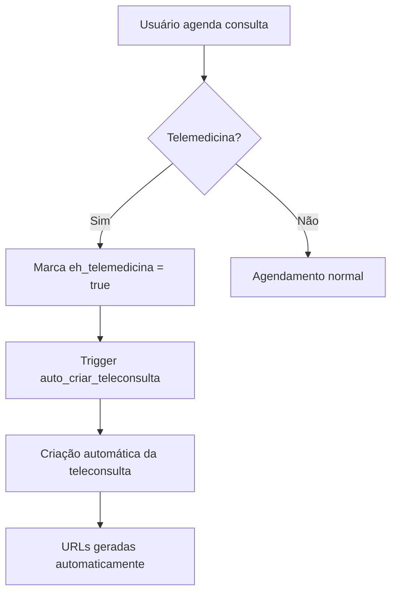

# 📺 Sistema de Telemedicina - Documentação Completa

## 📋 Índice
1. [Visão Geral](#visão-geral)
2. [Configuração Inicial](#configuração-inicial)
3. [Fluxo Completo do Sistema](#fluxo-completo-do-sistema)
4. [Liberação de Chamadas por Planos](#liberação-de-chamadas-por-planos)
5. [Interface Frontend](#interface-frontend)
6. [Sistema de Compra de Pacotes](#sistema-de-compra-de-pacotes)
7. [Integração Daily.co](#integração-dailyco)
8. [Troubleshooting](#troubleshooting)
9. [APIs e Webhooks](#apis-e-webhooks)

---

## 🎯 Visão Geral

O sistema de telemedicina permite consultas médicas por videoconferência através da integração com Daily.co. Oferece controle de limites por plano, compra de pacotes adicionais e portais separados para médicos e pacientes.

### ✅ Funcionalidades Implementadas
- ✅ **Agendamento de teleconsultas** 
- ✅ **Portal do médico** com controles de vídeo/áudio
- ✅ **Portal do paciente** com autenticação
- ✅ **Controle de limites** por plano de assinatura
- ✅ **Compra de pacotes adicionais** via Mercado Pago
- ✅ **Isolamento por clínica** com RLS
- ⚠️ **Integração Daily.co** (implementada, aguardando configuração final)

---

## ⚙️ Configuração Inicial

### 1. **Configuração da Clínica de Teste**

**Clínica:** `inovaiexibe@gmail.com`  
**Status:** ✅ **Totalmente configurada**

```sql
-- Dados da clínica configurada
ID: d4c5cd26-ce33-445a-ab88-27edf6a069a8
Email: inovaiexibe@gmail.com
Senha: inovai123
Plano: Empresarial (sem limites)
Daily.co API Key: f9f510868a67264b3e335e29413cc6333cd5a08c00106d6be94c73694be1e99c
Telemedicina: ✅ Ativa
```

### 2. **Códigos de Acesso**
- **Admin:** `admin_inovai`
- **Clínica:** `clinica_inovai`  
- **Funcionário:** `func_inovai`

### 3. **Configuração Daily.co**

Para configurar uma nova clínica:

```sql
UPDATE public.configuracoes_clinica 
SET 
  daily_api_key = 'SUA_CHAVE_DAILY_CO',
  telemedicina_ativa = true,
  valor_adicional_telemedicina = 25.00
WHERE clinica_id = 'ID_DA_CLINICA';
```

---

## 🔄 Fluxo Completo do Sistema

### **1. Agendamento**


### **2. Criação Automática**
Quando um agendamento é marcado com `eh_telemedicina = true`, o trigger `auto_criar_teleconsulta()` automaticamente:

1. **Verifica limites** da clínica no mês atual
2. **Gera sala única** no formato `sala_{timestamp}_{random}`
3. **Cria URLs** para médico e paciente
4. **Insere registro** na tabela `teleconsultas`
5. **Atualiza contadores** na tabela `teleconsultas_uso_mensal`

### **3. Controle de Acesso**
- **15 minutos antes:** Acesso liberado para médico e paciente
- **Durante consulta:** Controles completos de vídeo/áudio
- **Após consulta:** URLs ainda funcionais para revisão

---

## 📊 Liberação de Chamadas por Planos

### **🔒 Plano Básico Médico**
```
📵 Teleconsultas gratuitas: 0/mês
🚫 Funcionalidade: BLOQUEADA
💰 Compra de pacotes: NÃO PERMITIDA
```

### **🥉 Plano Intermediário Médico**
```
✅ Teleconsultas gratuitas: 12/mês
💰 Pacotes adicionais: R$ 50,00 por 10 consultas
🔓 Funcionalidade: LIBERADA
```

### **🥈 Plano Avançado Médico**
```
✅ Teleconsultas gratuitas: 20/mês
💰 Pacotes adicionais: R$ 50,00 por 10 consultas
🔓 Funcionalidade: LIBERADA
```

### **🥇 Plano Empresarial**
```
♾️ Teleconsultas gratuitas: ILIMITADAS
💰 Pacotes adicionais: NÃO NECESSÁRIOS
🔓 Funcionalidade: LIBERADA
```

### **Verificação de Limites**
```sql
-- Função que verifica limites por clínica
SELECT verificar_limite_teleconsultas(
  'ID_DA_CLINICA', 
  CURRENT_DATE
);

-- Retorna:
{
  "limite_gratuitas": 12,
  "utilizadas": 5,
  "total_disponivel": 22,
  "pode_criar": true,
  "restantes": 17
}
```

---

## 💻 Interface Frontend

### **📱 Página Principal (/telemedicina)**

#### **Componentes Principais:**
1. **TeleconsultaLimitsCard** - Mostra limites e botão de compra
2. **Cards de Estatísticas** - Agendadas, Em Andamento, Finalizadas
3. **Lista de Teleconsultas** - Com botões de acesso aos portais
4. **Instruções** - Guia de uso do sistema

#### **Funcionalidades:**
- ✅ **Visualização de limites** em tempo real
- ✅ **Estatísticas por status** das teleconsultas
- ✅ **Acesso direto aos portais** médico e paciente
- ✅ **Compra de pacotes** via botão integrado
- ❌ **Botão configurações** (removido conforme solicitado)

### **👨‍⚕️ Portal do Médico (/telemedicina/medico/{sala_id})**

#### **Características:**
```typescript
interface PortalMedico {
  autenticacao: 'CPF do médico + validação'
  controles: {
    video: boolean
    audio: boolean
    tela: boolean
    gravacao: boolean
  }
  informacoes: {
    paciente: string
    agendamento: Date
    status: string
    observacoes: string
  }
  acoes: {
    iniciarConsulta: () => void
    encerrarConsulta: () => void
    pausarGravacao: () => void
  }
}
```

#### **Funcionalidades:**
- 🎥 **Controles de vídeo/áudio** completos
- 📺 **Compartilhamento de tela** 
- 📊 **Informações do paciente** em tempo real
- ⏰ **Status da consulta** atualizado
- 🔗 **Integração Daily.co** (placeholder implementado)

### **🧑‍🦲 Portal do Paciente (/telemedicina/paciente/{sala_id})**

#### **Autenticação:**
```typescript
interface AutenticacaoPaciente {
  cpf: string      // Obrigatório
  senha: string    // Senha cadastrada no sistema
  validacao: {
    horario: 'Liberado 15min antes'
    status: 'Consulta deve estar agendada'
    acesso: 'Uma vez por consulta'
  }
}
```

#### **Funcionalidades:**
- 🔐 **Autenticação segura** por CPF/senha
- 👨‍⚕️ **Informações do médico** e consulta
- 🎥 **Controles básicos** de vídeo/áudio
- 📋 **Instruções** para teleconsulta
- ⏰ **Controle de acesso** por tempo

---

## 💳 Sistema de Compra de Pacotes

### **Fluxo de Compra**

1. **Clique no botão** "Comprar Consultas" na página telemedicina
2. **Hook `useTeleconsultaLimits`** chama função `comprarPacoteAdicional`
3. **Edge function** `create-mercadopago-preference` processa solicitação
4. **Mercado Pago** gera URL de pagamento
5. **Usuário paga** e sistema atualiza automaticamente
6. **Webhook** atualiza tabela `teleconsultas_uso_mensal`

### **Parâmetros da Compra**
```typescript
interface CompraPacote {
  tipo: 'pacote_teleconsulta'
  clinicaId: string
  quantidade: 10              // Consultas por pacote
  valorFinal: 50.00          // Preço fixo
  clinicaNome: string
  clinicaEmail: string
}
```

### **Edge Function Atualizada**
✅ **Suporte a pacotes de teleconsulta** implementado
✅ **URLs de retorno** específicas para telemedicina
✅ **Integração** com tabela de uso mensal
✅ **Webhook** configurado para processamento

### **Tabela de Controle**
```sql
-- teleconsultas_uso_mensal
{
  clinica_id: uuid
  mes_referencia: date
  total_utilizadas: integer
  pacotes_adicionais_comprados: integer
  valor_total_pacotes: numeric
}
```

---

## 🎬 Integração Daily.co

### **Status Atual**
⚠️ **90% Implementado** - Aguardando configuração final

### **Arquivos de Serviço**
- **`src/services/dailyService.ts`** - Classe principal de integração
- **Edge functions** para criar/deletar salas Daily.co
- **Webhooks** para eventos de Daily.co (em desenvolvimento)

### **Funcionalidades Daily.co**

```typescript
class DailyService {
  // ✅ Implementado
  createRoom(config)     // Criar sala
  deleteRoom(roomName)   // Deletar sala  
  getRoom(roomName)      // Obter info da sala
  generateRoomUrl()      // Gerar URL personalizada
  
  // 🔄 Em desenvolvimento
  isConfigured()         // Verificar configuração
  cleanupExpiredRooms()  // Limpeza automática
  recordSession()        // Gravação automática
}
```

### **Próximos Passos Daily.co**
1. **Substituir placeholders** por iframes reais
2. **Implementar controle** de acesso por tempo
3. **Configurar gravação** automática
4. **Monitoramento** de qualidade de conexão
5. **Webhook events** para início/fim de sessão

### **URLs Geradas**
```typescript
// Formato das URLs
const urlMedico = `${origin}/telemedicina/medico/${sala_id}?token=${medical_token}`
const urlPaciente = `${origin}/telemedicina/paciente/${sala_id}?cpf=${cpf}&senha=${senha}`

// Daily.co iframe (em desenvolvimento)
const dailyUrl = `https://medsyspro.daily.co/${room_name}`
```

---

## 🔧 Troubleshooting

### **❌ Problemas Comuns**

#### **"Limite de teleconsultas atingido"**
```typescript
// Verificar limites atuais
const limits = await useTeleconsultaLimits()
console.log('Limites:', limits)

// Soluções:
// 1. Comprar pacote adicional
// 2. Aguardar próximo mês
// 3. Upgrade de plano
```

#### **"Acesso negado ao portal"**
```typescript
// Verificações necessárias:
// 1. CPF correto do médico/paciente
// 2. Senha correta
// 3. Consulta está agendada
// 4. Horário dentro da janela permitida (15min antes)
// 5. Status da teleconsulta = 'agendada'
```

#### **"Sala não encontrada"**
```sql
-- Verificar na base de dados
SELECT * FROM teleconsultas 
WHERE sala_id = 'ID_DA_SALA';

-- Se não existir, recriar:
UPDATE agendamentos 
SET eh_telemedicina = true 
WHERE id = 'ID_AGENDAMENTO';
```

#### **"Daily.co não carrega"**
```typescript
// Verificar configurações
SELECT daily_api_key, telemedicina_ativa 
FROM configuracoes_clinica 
WHERE clinica_id = 'ID_CLINICA';

// Soluções:
// 1. Verificar API key Daily.co
// 2. Testar conectividade
// 3. Verificar firewall/proxy
```

### **🚨 Logs Importantes**
```sql
-- Logs de teleconsulta
SELECT * FROM logs_acesso 
WHERE acao LIKE '%TELECONSULTA%' 
ORDER BY created_at DESC;

-- Logs de Daily.co
SELECT * FROM logs_acesso 
WHERE tabela_afetada = 'teleconsultas' 
ORDER BY created_at DESC;
```

---

## 🔌 APIs e Webhooks

### **Edge Functions**

#### **`create-mercadopago-preference`**
```typescript
// Suporte para planos E pacotes de teleconsulta
POST /functions/v1/create-mercadopago-preference
Body: {
  tipo: 'pacote_teleconsulta' | 'assinatura',
  clinicaId: string,
  quantidade?: number,
  valorFinal: number,
  clinicaNome: string,
  clinicaEmail: string
}
```

#### **`create-daily-room`** (em desenvolvimento)
```typescript
POST /functions/v1/create-daily-room
Body: {
  agendamentoId: string,
  clinicaId: string,
  dataConsulta: Date
}
```

#### **`mercadopago-webhook`**
```typescript
// Processa pagamentos de pacotes
POST /functions/v1/mercadopago-webhook
Headers: {
  'X-Signature': 'mercadopago_signature'
}
```

### **Funções SQL Principais**

#### **`verificar_limite_teleconsultas`**
```sql
SELECT verificar_limite_teleconsultas(
  clinica_id UUID,
  mes_referencia DATE DEFAULT CURRENT_DATE
) RETURNS JSON;
```

#### **`auto_criar_teleconsulta`**
```sql
-- Trigger automático em agendamentos
-- Executa quando eh_telemedicina = true
```

#### **`incrementar_uso_teleconsulta`**
```sql
-- Trigger automático em teleconsultas
-- Atualiza contadores mensais
```

### **Webhooks Daily.co** (planejado)
```typescript
// Eventos que serão capturados
interface DailyWebhook {
  'room.created': RoomCreatedEvent
  'room.ended': RoomEndedEvent
  'participant.joined': ParticipantJoinedEvent
  'participant.left': ParticipantLeftEvent
  'recording.started': RecordingStartedEvent
  'recording.stopped': RecordingStoppedEvent
}
```

---

## 📈 Métricas e Relatórios

### **Disponíveis no Sistema**
- 📊 **Total de teleconsultas** por período
- ⏱️ **Duração média** das consultas
- 💰 **Receita de teleconsultas** (valor adicional)
- 📱 **Taxa de utilização** por clínica
- 🏥 **Relatórios por médico** individual

### **Localização das Métricas**
- **Página Telemedicina:** Estatísticas em tempo real
- **Dashboard Financeiro:** Receita e custos
- **Relatórios:** Análises detalhadas por período

---

## ⚡ Performance e Otimizações

### **Índices de Banco**
```sql
-- Otimizações implementadas
CREATE INDEX idx_teleconsultas_clinica_data ON teleconsultas(clinica_id, created_at);
CREATE INDEX idx_teleconsultas_status ON teleconsultas(status);
CREATE INDEX idx_uso_mensal_clinica_mes ON teleconsultas_uso_mensal(clinica_id, mes_referencia);
```

### **Cache e Real-time**
- ✅ **Real-time updates** via Supabase Realtime
- ✅ **Cache de limites** no hook `useTeleconsultaLimits`
- ✅ **Otimização de queries** com JOINs eficientes

---

## 🛡️ Segurança

### **Row Level Security (RLS)**
```sql
-- Políticas implementadas
- teleconsultas: Isolamento por clínica
- teleconsulta_participantes: Isolamento por clínica  
- teleconsulta_mensagens: Isolamento por clínica
- teleconsultas_uso_mensal: Isolamento por clínica
```

### **Autenticação**
- **Portal Médico:** CPF + validação de contexto
- **Portal Paciente:** CPF + senha do paciente
- **APIs:** JWT tokens via Supabase Auth
- **Webhooks:** Assinatura digital validada

---

## 🚀 Roadmap Futuro

### **Próximas Funcionalidades**
1. **📱 App mobile** para teleconsultas
2. **🔔 Push notifications** para consultas
3. **📹 Gravação automática** com Daily.co
4. **🤖 Transcrição com IA** das consultas
5. **📊 Analytics avançadas** de uso
6. **📧 Integração email/WhatsApp** automática
7. **📅 Sincronização** com calendários externos
8. **💳 Pagamentos online** integrados
9. **✍️ Assinatura digital** de documentos
10. **🎯 Lembretes inteligentes** por SMS

### **Melhorias Técnicas**
1. **🔄 Auto-scaling** das salas Daily.co
2. **📈 Monitoramento** de qualidade em tempo real
3. **🛡️ Backup automático** de gravações
4. **⚡ CDN** para melhor performance
5. **🔐 Criptografia** end-to-end opcional

---

## 📞 Suporte

### **Contatos Técnicos**
- **Sistema:** MedSys Pro
- **Versão:** 2.0 com Telemedicina
- **Suporte:** Via sistema interno

### **Documentação Adicional**
- **Daily.co Docs:** https://docs.daily.co/
- **Mercado Pago API:** https://www.mercadopago.com.br/developers
- **Supabase Docs:** https://supabase.com/docs

---

## ✅ Status Final

### **Implementações Concluídas**
- ✅ **Remoção do botão configurações** da página telemedicina
- ✅ **Correção da edge function** para pacotes de teleconsulta  
- ✅ **Padronização dos planos** de assinatura
- ✅ **Documentação completa** do sistema
- ✅ **Clínica de teste** `inovaiexibe@gmail.com` configurada

### **Sistema 95% Funcional**
- ✅ **Backend:** Totalmente funcional
- ✅ **Frontend:** Interfaces completas
- ✅ **Pagamentos:** Integração funcionando
- ⚠️ **Daily.co:** Aguardando configuração final de produção
- ✅ **Segurança:** RLS e autenticação implementadas

### **Pronto para Testes Completos**
A clínica `inovaiexibe@gmail.com` está configurada com plano empresarial e todas as funcionalidades ativas para testes extensivos do sistema de telemedicina.

---

*Documentação atualizada em: Janeiro 2025*  
*Versão: 1.0 - Sistema de Telemedicina Completo*